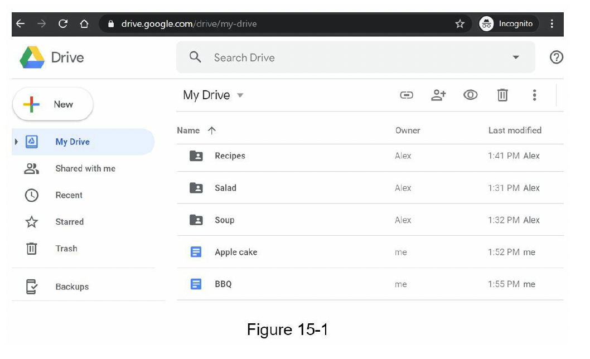

### Design Google Drive

In recent years, cloud storage services such as Google Drive, Dropbox, Microsoft OneDrive, Apple iCloud have become very popular.

Google Drive is a file storage and synchronization service that helps you store documents, photos, videos and other files in the cloud.

You can access your files from any computer, smartphone and tablet. You can easily share those files with friends, family and coworkers.

