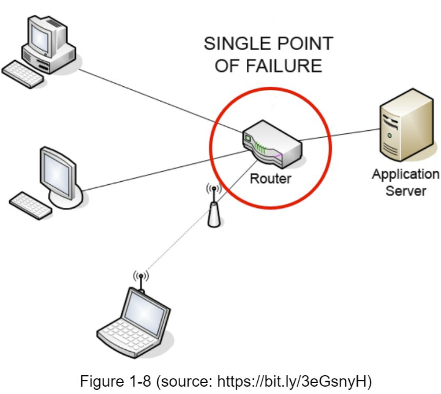

#### Cache

##### Consideration for using cache:
   **1.When to use cache?:**  
    *Data is read frequently, modified infrequently. 
    *Cached data is stored in volatile memory, a cache server is not ideal for persisting data.
    *For instance, when the cache server restarts, the entire data in the memory gets lost.
    *Important data should be saved in persistent data stores.

  **2.Expiration Policy:** 
     *Once Cache data is Expired, it is removed from the Cache.
     *If there is no expiray policy, cached data will be stored permanently in the memory.
     *It is advisable to not to make expiration date too short as this cause the reload of data from *the database too frequently.
     *Meanwhile, if the expiration data is too long, the data can become stale.

 **3.Consistency:** 
     *Keeping the data in synce between cache and data store.
     *Inconsistency can happen because data-modiying operations on data store and cache are not in a single transaction.
     *When scaling across multiple regions, maintaining data store and cache is challenging.
     * For further details , refer to "Scaling Memcache at Facebook".
  
**4. Mitigating Failures:**
    * **Single Point Of Failure (SPOF):** is a part of system, if it fails, will stop entire system for working. Multiple cache servers across different data centers are important to avoid SPOF.
    * Another recommended approach is to overprovision the required memory by certain percentages, this provided a buffer as the memory usage increases.
 

**5: Eviction Policy:**
    * Once the cache is full, any requests to add items in the cache might cause existing items to be removed. This is called Cache eviction.
    * LRU-Least Recently Used (LFU), First-In-First-Out can be adopted depending on the use cases.
  
     

   