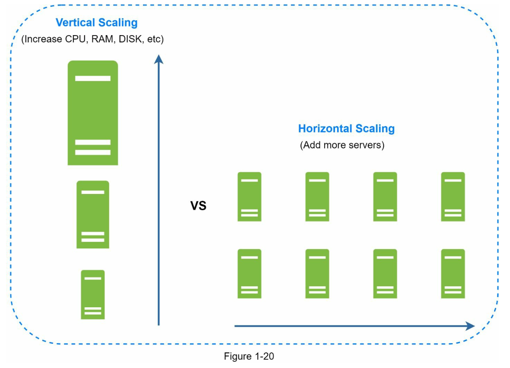
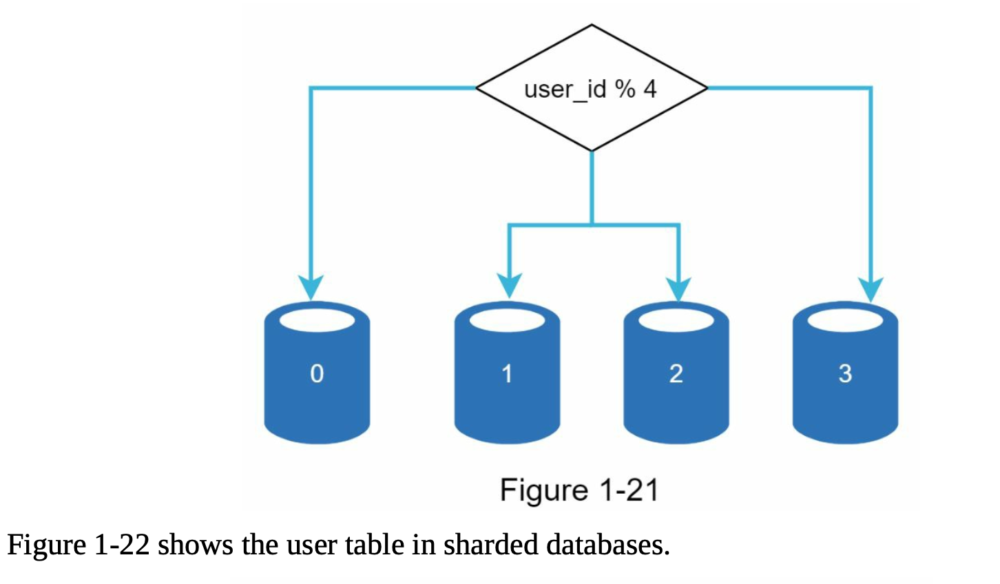
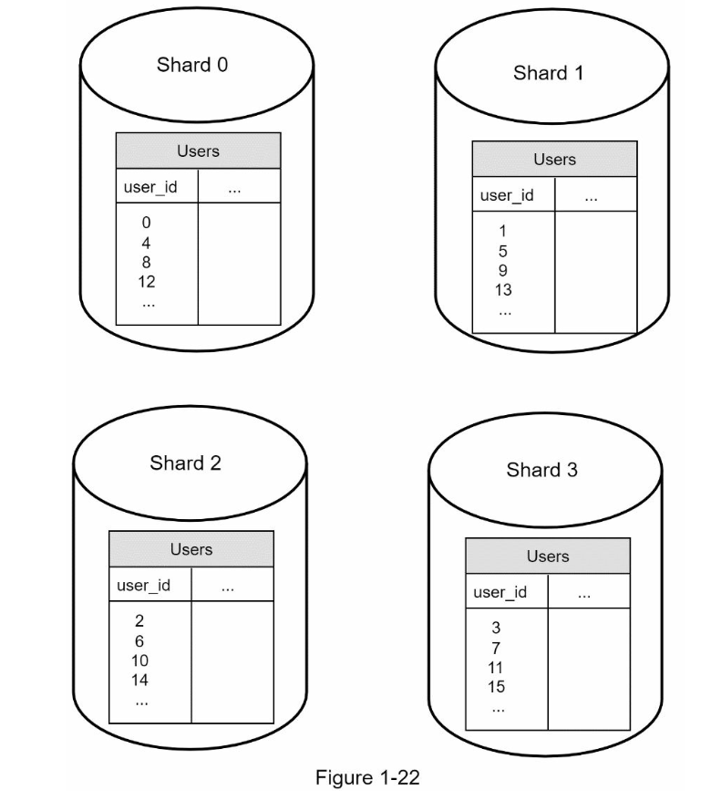
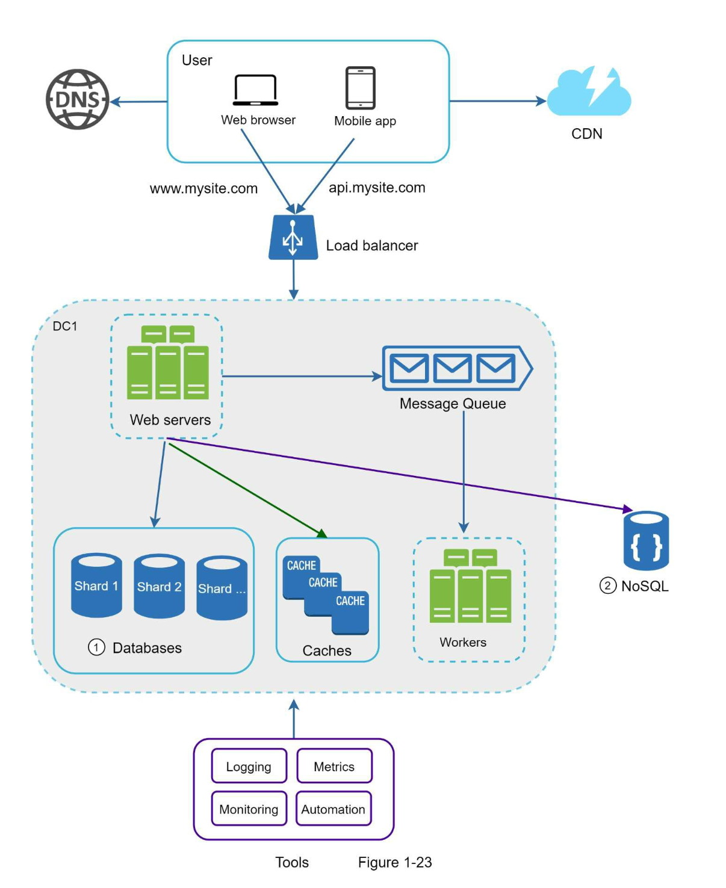

#### Database scaling:

  **Vertical scaling** [Scaling up]                         

 * Adding more power (CPU,RAM,DISK etc.,) to existing machin 
 * According to Amazon RDS, you can get a database server with 24 TB of RAM. these kind of powerful database servers can handle lots of data. 
 * For eg, stackoverflow.com in 2013 had over 10 million monthly unique visitors, but it only had 1 master database.
   
 **Cons of vertical scaling :**
 * Add CPU,RAM etc., to your database server, due to hardware limits. 
 * If you have larger user base, single server is not enough.  
 * Greater risk of single point servers.
 * The overall cost of vertical scaling is high. Powerful servers are much more expensive.         

 **Horizontal scaling** [Scaling down] 
 * Adding more servers.
 * Sharding separates large databases into smaller, more easily managed parts called shards.
 * Each shard shares the same schema, through the actual data on each shard is unique to the shard.
  
 Figure below shows an example of shared databases, User data is allocated to a database server based on user IDs.
 Anytime you access data, a hash function is used to find the corresponding shard. In our example, user_id%4 is used as hash function.

  

   

  **Sharding key** plays significant role while implementing sharding strategy.
  * Sharding key (Partition key) consists of one or more columns that determine how the data is distributed.
  * For eg, In the above scenario, "user_id" is the sharding key.
  * Sharding key allows you to retrieve and modify data efficiently by routing database queries to the correct database.
  * Choose a key that can evenly distributes the data.

 **Cons of Sharding:**
 * **Resharding the data:** 
    * Single shard could no longer hold more data due to rapid growth.
    * Certain shards might exhaust faster due to uneven distribution of data. When shard exhaustion occurs, then sharding function needs to be updated and data is to moved around.
* **Celebrity problem:**
    * Also called as hotspot key problem.
    * Excessive access to a specific shard could cause server overload.
    * For Eg, celebrities like Taylor swift, Selena Gomez etc., may end up on the same shard.
    * For social media applications, that shard will be overwhelmed with read operations.
    * To solve this problem, we may need to allocate a shard for each celebrity, and each shard might need further partition.
*  **Join and de-normalization**
    * Once a database is shared across multiple servers, performing join operations across multiple shards will be difficult.
    * A common workaround will be denormalizing the database so that queries can be performed in a single table.

The above figure depicts the shard databases to support rapidly increasing traffic.
some of the non-relational functionalities are moved to NoSQL data store to reduce work load.

  

