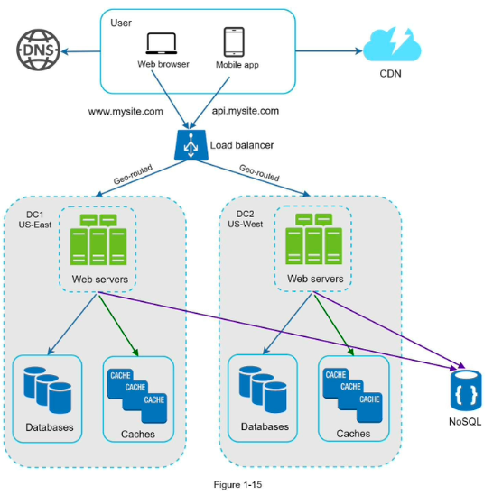
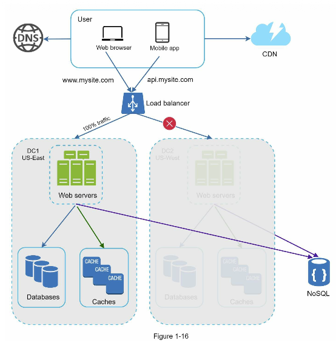

#### Data centers

In the example, there are two Data centers. In normal operations, users are GeoDNS-routed, splits the traffic of the users into x% US-East, (100-x)% US-West.

GeoDNS- resolves the IP address based on the location of the user.

whenever there is data-center outrage, all the traffic is redirected to a healthy data center.

Several technical challenges must be resolved to achieve multi-data center setup:

1. Traffic redirection: 
   Effective tools are needed to direct traffic to the correct data center like GeoDNS.
   
2. Data synchronization: 
    Users from different regions could use different local databases or caches.
    During outrages, traffic is redirected to the data center where is data is available.
    Common strategy is data replication across different data centers.

3. Test and deployment:
   With multi-data center setup, it is important to test your website/application at different locations. 
   Automated deployment tools are vital to keep services consistent through all data centers.

   To improve scalability further, we need to decouple different components of the system so they can be scaled independently.

   Message queues is a key strategy employed by many real-world distributed systems to solve this problem.

