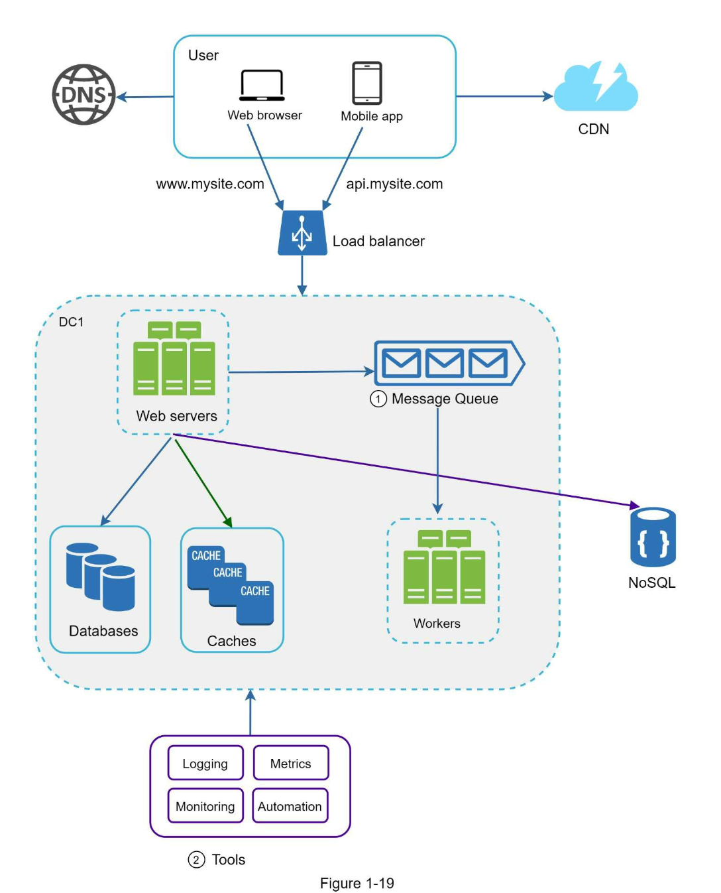

##### Logging, Metrics and Automation:

*  a small website can run on few servers, logging, metrics and automation support which are good practices.
*  when the website become large, those practices are essential.
  
**Logging:**
*  Monitoring error logs is important because it helps to identify errors and problems in the system.
*  Monitor error logs at server level or use tools to aggregate them to a centralized service for easy search and viewing.
  
**Metrics:**
* Collecting different types of metrics help us to gain business insights and understand the health status of the system.
* **Host metrics:**  CPU, Memory, disk I/O etc.,
* **Aggregated level metrics:**  performance of the entire database tier, ache tier etc.,
* **Key Business metrics:**  daily active users, retention, revenue etc.,

**Automation:**  
* When a system gets big and complex, we need to build or leverage automation tools to improve productivity.
* Continuous integration is a good pratice, in which each code check-in is verfied through automation, allowing teams to detect problems early
* Besides, automating your build, test, deploy process, etc. could improve productivity significantly.

**Adding message queues and different tools:**
*  The design includes message queue, which helps to make system more loosely copupled and failure resilient.
*  Logging, Monitoring Metrics and Automation tools are included.

* As the data grows every day, your database gets more overloaded.  It is time to scale the data tier.

