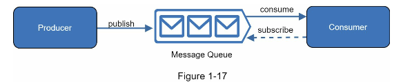

Message Queue is a durable component, stored in memory, that supports asynchronous communication.
It serves as a buffer and distributes asynchronous requests.

The architecture consists of **producer** that create messages and publish them to the message queue.
Other services or servers, called **consumers/subscribers** connect to the queue and perform actions defined by messages.

**Decoupling** makes the message queue a preferred architectire for building scalable and reliable connection.  Producer can post message to the queue, if Consumer is unavailable and When Producer is unavailable, Consumer can read messages from the queue.

**usecase:** when customizing photo, the producer publishes the photo to the queue, the Photo processing workers aka.. consumer picks up the photo and asynchronously performs the editing operations. Both producer and consumer can be scaled independently.

When the size of the queue becomes large, more workers are added to reduce the processing time. 
However, if the queue is empty most of the time, the number of workes can be reduced.

