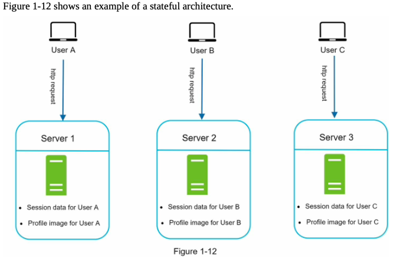
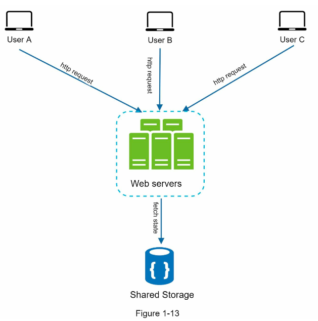
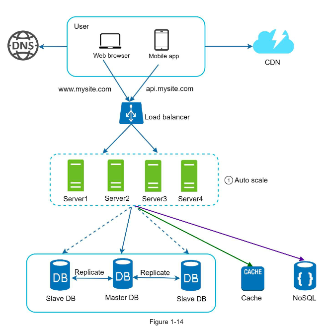

#### Stateless Web Tier 

* Scaling the web tier horizontally. 
* Moving the state (say, user session data) out of web tier.
* good practice is to store session data in persistent storage such as relational database or NoSQL.
* Each web server in the cluster can access the state data from databases.
* This is called stateless web tier

##### Stateful architecture:
* A stateful server remembers client date (state) from one request to the next. 
* A stateless server keeps no state information 

User A' session data and profile image is stored in server 1
User B in server 2, User C in server 3.

In order to get User A information, the HTTP requests are routed to server 1, and remaining server 2 and 3 cannot provide information of user A as they dont have the stored data except user B and user C respectively.

For every request from same client, has to be routed to same server. This can be done by sticky sessions in most load balancers, but this adds the overhead. Adding or removing servers is much more difficult with this approach. It is also challenging to handle server failures.

#### Stateless architecture:

All the HTTP requests from the client can be sent any webserver, they access the state data stored in shared data store and kept out of web servers. A stateless system is simpler, robust and scalable.

* Move the session data out of the web tier and store them in persistent data store.
* The shared data store could be a relational database, Memchached/Redis, No SQL etc.,
* The NoSQL data store is chosen as it is easy to scale. 
* Autoscaling can be easily done by adding or removing web servers  automatically based on traffic load.
* To improve availability to the high growing traffic of users across multiple geographical areas, supporting multiple data centers is crucial.

