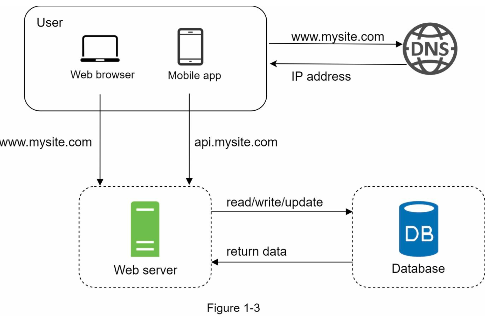

**Database:**

 |  **Relational/SQL**               |       **Non-Relational/NOSQL**        |
 | --------------------           | ------------------------------    |
 | MySQL,Oracle,PostgreSQL etc.,  | CouchDB, Neo4j, Cassandra, HBase, Amazon DynamoDB etc.,|
 | Data stored in tables and rows | key-value stores, Graph, COlumn, Document |
 | Join operations across diff. tables |. Join operations are not supported |

Non-relational databases might be right choice if 
* application requires super-low latency
* data is unstructured, no relational data
* only serialize and deserialize data ( JSON, XML, YAML, etc.,)
* storing massive amount of data

**Vertical v/s Horizontal Scaling:**

| Vertical[ scale-up ]              | Horizontal[scale -down] |
| ------------------------          |  ---------------------- |
| adding more power (CPU,RAM,etc.,) to servers| adding more servers to the pool of resources. |
| 
                                         

