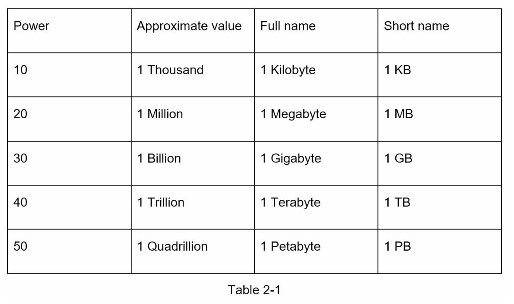
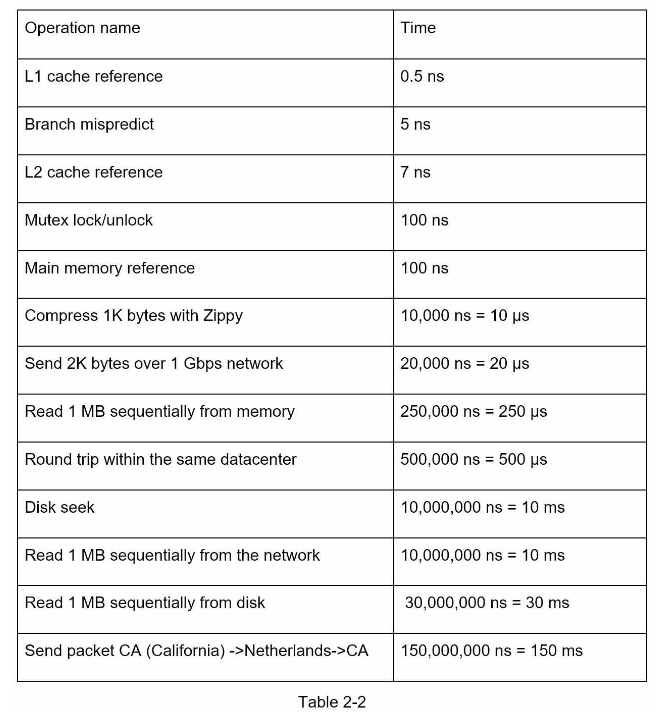
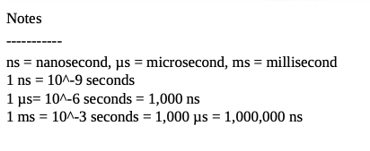
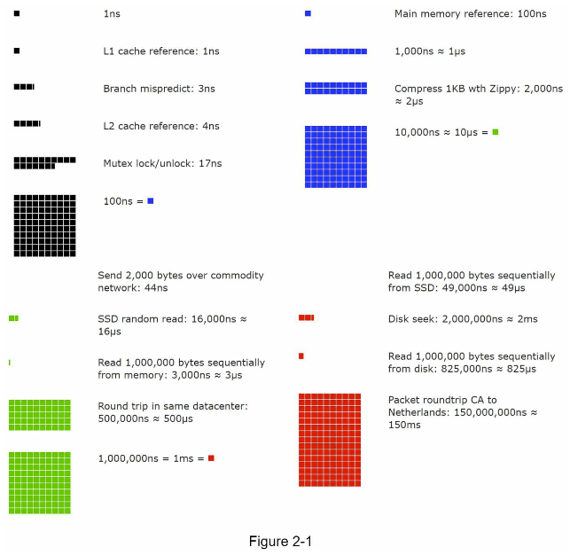
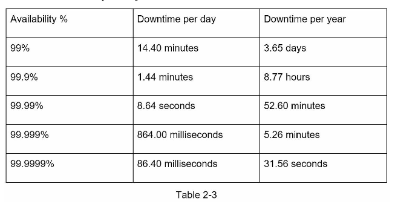

#### Back-Of-The-Envelope-Estimation

According to JeffDean, Google Senior Fellow, "back of the envelope estimation is created using a combination of thoughtful experiments and common performance numbers to get a good feel for which designs will meet your requirements.

You need to have a good sense of scalability basics to effectively carry out back-of-the-envelope estimation.

The following concepts should be well understood.
* Power of two
* Latency numbers
* Availability numbers

##### Power of Two:

* Although data volume can become enormous while dealing with the distributed systems, calculation boils down to the basics.
  

##### Latency numbers every programmer should know:

Dr Dean from Google reveals the lenght of typical computer operations back in 2010.
Some computations are outdated as computers become faster and powerful. However, those numbers should be still be able to give us an idea of the fastness and slowness of different operations.

**Visualization of Latency numbers**

conclusions from the above metrics:
* Memory is fast but the disk is slow.
* Avoid disk seeks if possible.
* Simple compression algorithms are fast.
* Compress data before sending it over network if possible.
* Data centers are usually in different regions, and it takes time to send data between them.
  
#### Availability numbers

* High availability is the ability of a system to be continuously operational for a desirably long period of time.
* High  availability is measured as a percentage, with 100% means a service that has zero downtime.
* Most services fall between 99% and 100%.
  

* **Service Level Agreement(SLA)** is a commonly used term for service providers. This is an agreement between the provider and consumer and this agreement formally defines the level of uptime your service will deliver. Uptimes are usually measured in nines, the better.
  
Cloud providers Amazon, Google and Microsoft set their SLA's 99.9% and above.

