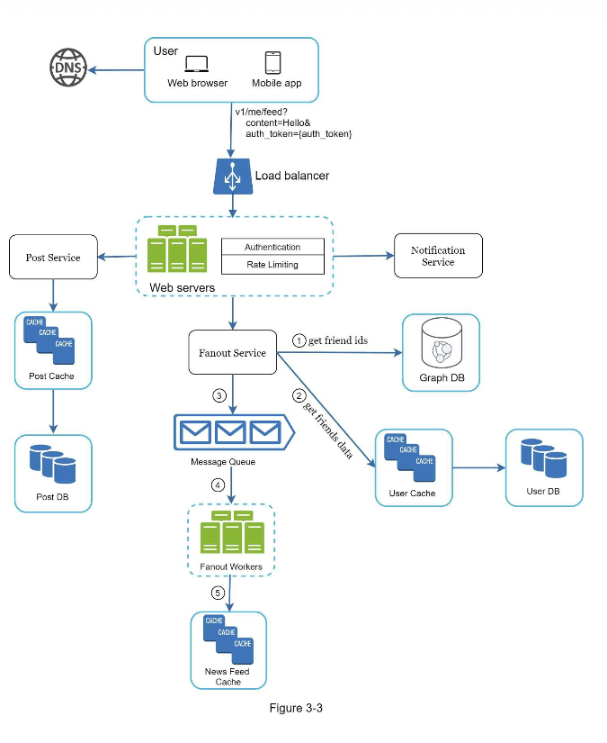
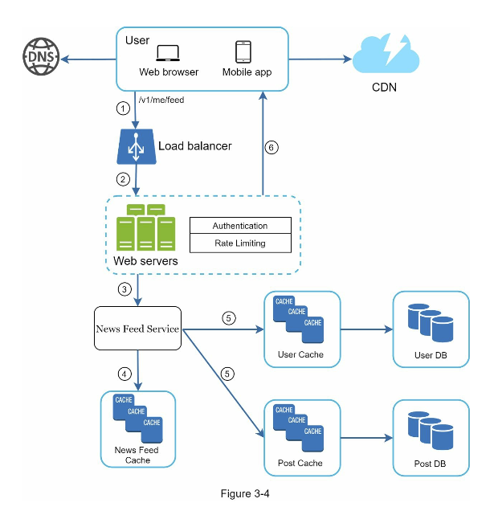

#### Design Deep Dive

* Agreed on the overall goals and feature scope.
* Sketched out a high-level blue print for the overall design
* Obtained feedback from your interviewer on the high-level design
* Had some initial ideas on which areas to focus on in deep dive based on her feedback.

Example, in the news feed system.

**Feed Publishing:**

**News Feed Retrieval:**

