##### Step 2- Propose high-level design and get buy-in

**Where to put the rate limiter?**

Intuitively, rate-limiter can be implemented at either client side or server side.

**Client-side implememtation:** Generally, this is unreliable as the requests can be forged by multiple malicious actors. Moreover, we dont have control over client implementation.

**Server-side implementation:** 

rate-limiter placed at server-side.

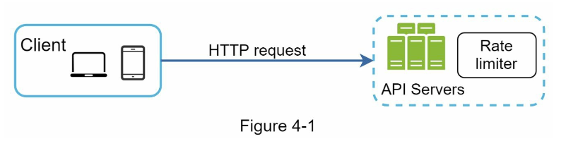

alternative way is to place rate limiter as middleware between client and server, which throttles requests to your APIs.

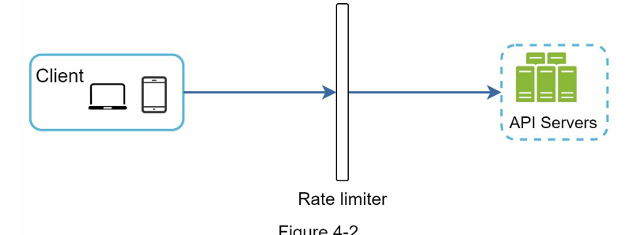

For Eg, Say, API allows 2 requests per second, Client sends 3 requests to the server.
The first two requests are redirected to API servers, the rate limiter throttles the third request and sends the HTTP status code 429.
The HTTP status code 429 indicates a user has sent too many requests.

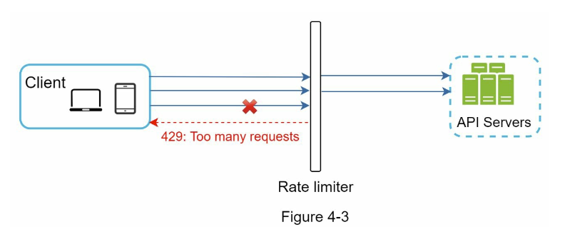

Cloud microservices have become widely popular and rate limiting is usually implemented within a component called API gateway.
API gateway is a fully managed service that supports rate limiting, SSL termination, authentication, IP whitelisting, servicing sattic content, etc., 

While designing a rate limiter, an important question to ask for ourselves, where exactly the rate limiter can be implemented?
Is it inside server or in a gateway? No absolute answer.
It depends on the company technology stack, engineering resources, priorities, goals, etc.,

Few guidelines to remember:
* Evaluate your current technology stack, such as programming language, cache service etc., Make sure your current programming language is efficient to implement rate limiting on the server side.
* Identify rate limiting algorithm that fits your business needs. When you implement everything on the server side, you have full control of the algorithm.  However, your choice will be limited when you use third party gateway.
* If you have already used microservice architecture and included an API gateway in the design to perform authentication, IP whitelistimg etc., you may add a rate limiter to the API gateway.
* Building your own rate limiter takes time, It is okay to use commercial API gateway when there no enough engineering resources to implement a rate limiter.

**Algorithms for rate limiting**

Rate limiter can be implemented using different algorithms, and each of them has distinct pros and cons. The understanding of algorithms at high-level helps to choose right algorithm or combinations of algorithms to fit our usecases. list of popular algorithms as follows,
* Token bucket
* Leaking bucket
* Fixed window counter
* Sliding window log
* Sliding window counter

**Token bucket algorithm:**

widley used for rate limiting. Simple, well understood and commonly used by internet companies. Both Amazon and Stripe use this algorithm to throttle their API requests.

The token bucket algorithm work as follows:
* consists of token bucket that has pre-defined capacity, Tokens are put periodically at preset rates periodically.
* once the token bucket is full, then no more tokens are added. 
* The refiller puts 2 tokens into the bucket every second, once the bucket is full, extra tokens will overflow.
  
  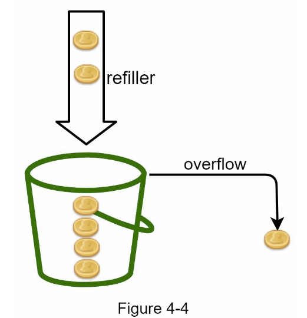

* Each request consumes one token. When a request arrives, we check if there are enough tokens in the bucket. 
  * If there are enough tokens, we take one token out for each request, and the request goes through.
  * If there are not enough tokens, the request is dropped.
  
 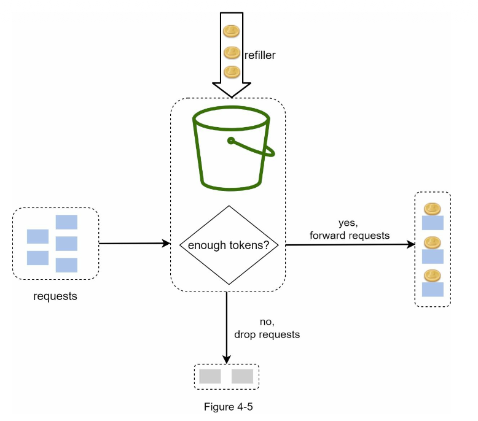

 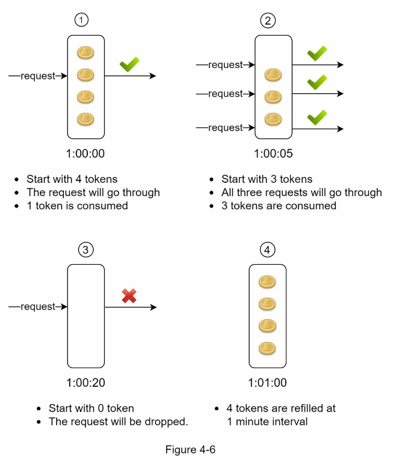

 Token bucket takes two parameters:

 * Bucket size: the maximum number of tokens allowed in the bucket.
 * Refill rate: number of tokens put into the bucket every second.
  
How many buckets do we need? This varies and it depends on the rate-limiting rules.
* It is usually necessary to have different buckets for different API endpoints. 
  For instance, if a user is allowed to post 1 per second, add 150 friends per day, like 5 posts per second, then we require 3 buckets are required for each user.
* If we need to throttle requests based on IP addresses, each IP address requires a bucket.
* If the system allows a maximum of 10,000 requests per second, it makes sense to have a global bucket shared by all requests.
  
**Pros:**
* The algorithm is easy to implement.
* Memory efficient
* Token bucket allows a burst of traffic for short periods. A request can go through as long as there are tokens left.

**Cons:**
* Two parameters in the algorithm are bucket size and token refill rate. However, it might be challenging to tune them properly.
  

**Leaking Bucket Algorithm:**
* Similar to Token bucket algorithm except that requests are processed at a fixed rate.
* It is ususally implemented in FIFO queue.
  
 **works as follows:**
* When a request arrives, the system checks if the queue is full. If it is not full, the request is added to the queue.
* Otherwise, the request is dropped.
* Requests are pulled from the queue and processed at regular intervals.

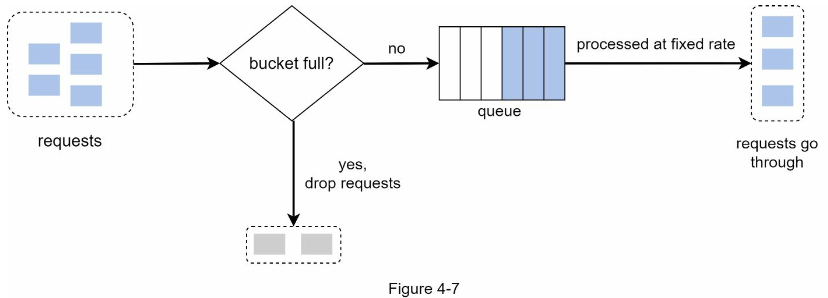

Leaking bucket algorithm takes following two parameters:
* **Bucket size:**  It is equal to the queue size. The queue holds the requests to be processed at a fixed rate.
* **Outflow rate:**  It defines how many requests can be processed at a fixed rate, usually in seconds.
  
  Shopify, an ecommerce company, uses leaky buckets for rate-limiting.
**Pros:**
* Memory efficient given the limited queue size.
* Requests are processed at a fixed rate therefore suitable for the use cases that a stable outlfow rate is needed.

**Cons**
* Due to fixed queue size, if the old requests fills up the queue and are not processed, then the new requests are rate limited.
* It might not be easy to tune the two parameters.
  
**Fixed window counter Algorithms**
* The algorithm divides the timeline into fix-sized time windows and assign a counter for each window.
* Each request increments the counter by one.
* Once the counter reaches the pre-defined threshold, new requests are dropped until a new time window starts.

For eg, in the below figure, system allows maximum of 3 requests per second, In each second window, if more than three requests are sent, then the extra requests are dropped.

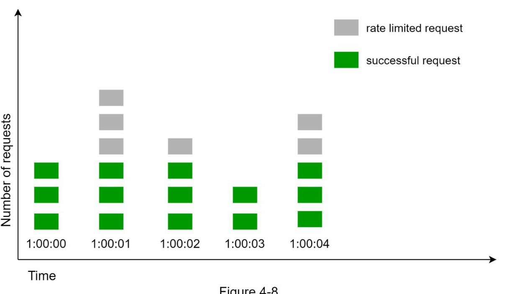

A major problem with this algorithm is that a burst of traffic at the edge of time windows could cause mre requests than allowed quota go through.

For eg, in the given figure, the system allows 5 requests between 2:00:00 to 2:01:00 and five more requests between 2:01:00 to 2:02:00. For the one minute window between 2:00:30 to 2:01:30, 10 requests go through. 

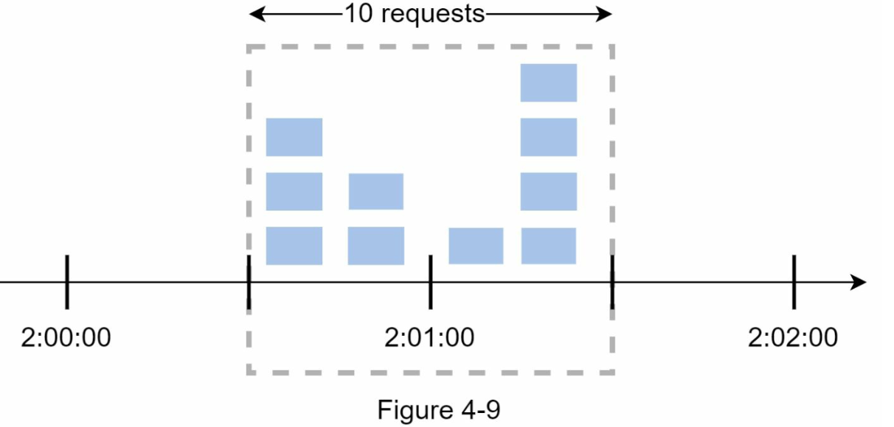

**Pros:**

* Memory efficient
* Easy to understand
* Resetting available quota at the end of the time window fits certain use cases.

**Cons:**
* Spike in traffic at th edges of the window could cause more requests than the allowed quota to go through.

**Sliding window log algorithm:**
  The Sliding window resolves the issue of fixed window counter algorithm of process of allowing more requests at the edge of the given window frame.

  * This algorithm keeps track of timestamps and stored usually in cache, such as sorted sets of Redis.
  * When a new request comes in, remove all outdated timestamps that are older than current time window.
  * Add timestamp of the new request to the log.
  * If the log size is the same or lower than the allowed count, a request is accepted, otherwise rejected.
  
  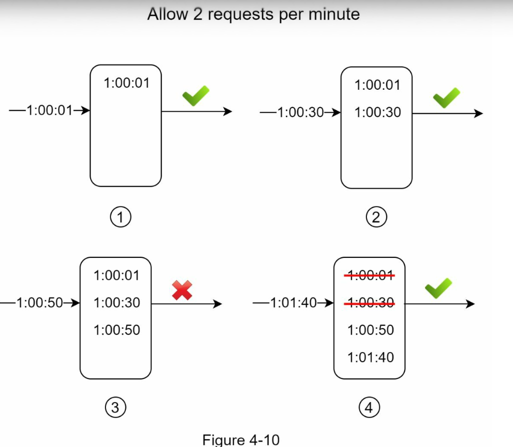

In the above example, rate limiter is set to accept 2 requests per minute. Usually, Linux timestamps are stored in the log. However, human-readable representation of time is used in our example for better readability.

* The log is empty when a new request arrives at 1:00:01, Thus, the request is allowed.
* A new request arrives at 1:00:30, the timestamp 1:00:30 is inserted into log, size of the log becomes 2 , not larger than the allowed count. Thus, the request is allowed.
* A new request arrives at 1:00:50, and the timestamp is inserted into the log. As the log size is now 3 larger than the actual max size 2 , the request gets rejected  even though the timestamp remains in the log.
* A new request arrives at 1:01:40, Requests in the range [1:00:40, 1:01:40] are within the latest time frame, but requests sent before 1:00:40 are outdated. Two outdated timestamps, 1:00:01 and 1:00:30 are removed from the log, After the remove operation, the log size becomes 2; therefore, the request is accepted.
  
**Pros:**
* Rate limiting implemented by this algorithm is very accurate. In any rolling window, requests will not exceed the rate limit.
  
**Cons:**
* The algorithm consumes a lot of memory as the time stamp of the request  might be stored in the memory even if the request gets rejected.

**Sliding window counter algorithm:**
Sliding window counter algorithm is a hybrid approach that combines both fixed window counter and sliding window log. The algorithm can be implemented by two different approaches. 

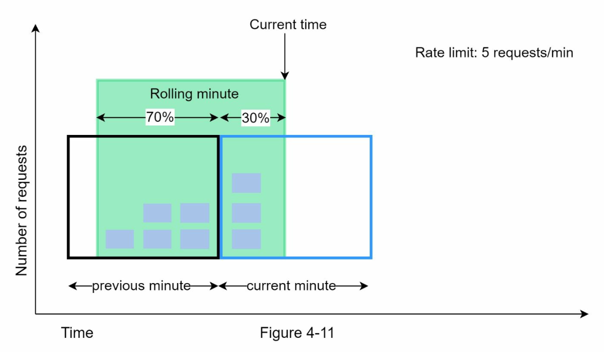

Assume the rate limiter allows maximum of 7 rewquests per minute, and there are 5 requests in the previous minute and 2 in current minute. For a new request that arrives at a 30% position in current minute, the number of requests in the rolling window is calculated as follows,

Requests in the current window + requests in the previous window * overlap percentage of the rolling window and previous window.

using the above formula, we get 3 + 5 * 0.7% = 6.5 requests.
Depending upon the usecase, the percentage can go either up or down. In this example, rounded to 6.

Since the rate limiter allows a maximum of 7 requests per minute, the current request can go through. However, the limit wil be reached on arrival of one more request.

**Pros:**
*  It smooths out spikes in the traffic because the rate is based on average rate of the previous window.

**Cons:**
* It only works for not-so-strict look back window. It is an approximation of actual rate because it assumes the requests in the previous window are evenly distributed. However, this problem may not be bad as it seems. According to experiments done by Cloudfare, only 0.003% of requests were wrongly allowed or rate limited among 400 million requests.

**High level architecture:**
**Basic Idea behind rate limiter is simple :**
At high level, we need a **counter** to keep track of how many requests are sent from the same user, IP address etc. If the counter is **larger** than the **limit**, the **request** is **disallowed**.

**where to share the counters**
Using the database is not good idea due to slowness of the disk access.
In-memory cache like Redis is a popular opinion to implement rate limiting. It is an in-memory store that offers two commands: INCR and EXPIRE.

**INCR:**  It increases the stored counter by 1.
**EXPIRE:** It sets out a timeout for the counter. If the timeout expires, the counter is automatically deleted.

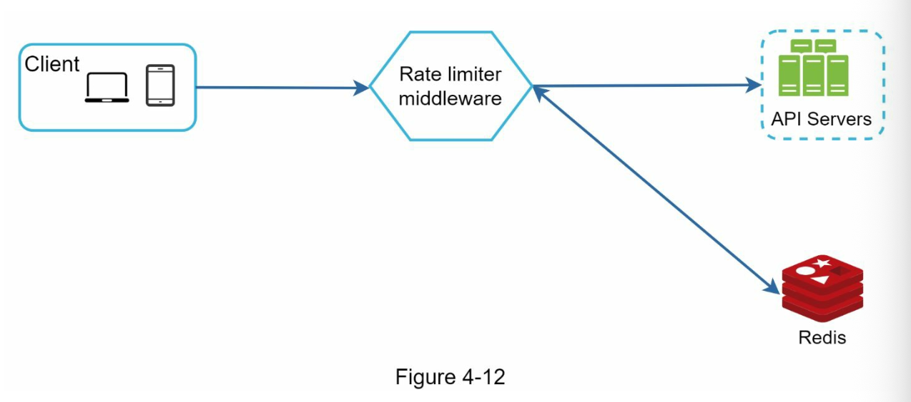

* The client sends a request to rate limiting middleware.
* Rate limiting middleware fetches the counter from the corresponding bucket in Redis and checks if the limit is reached or not.
       *  If the limit is reached, the request is rejected.
       *  If the limit is not reached, the request is sent to API servers. Meanwhile, the system increments the counter and saves it back to the Redis.
  

