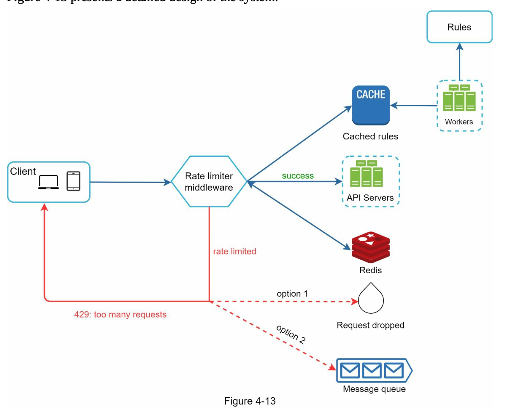
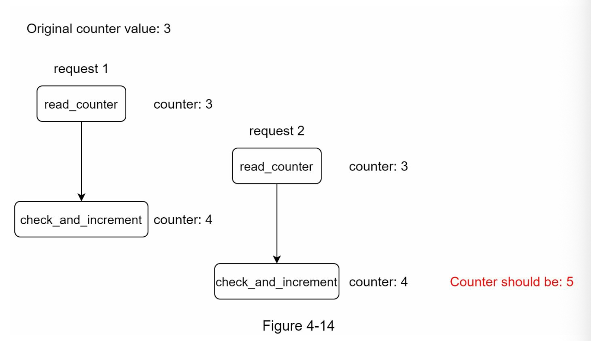
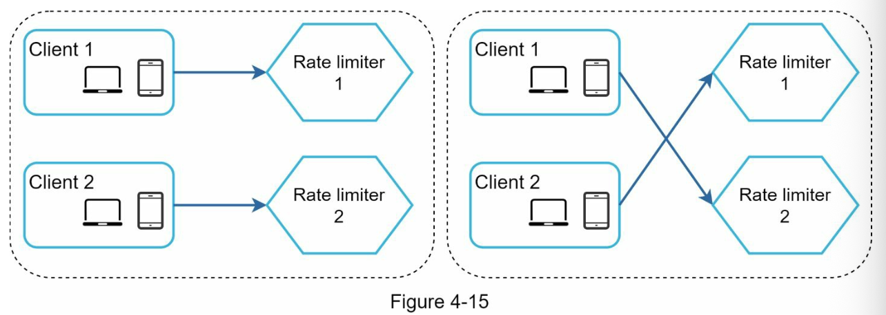
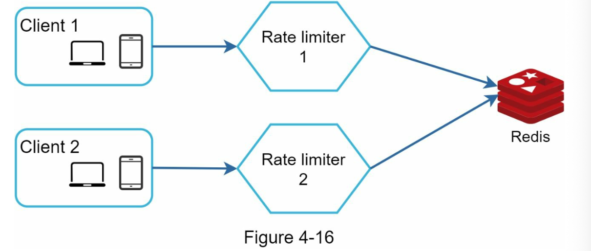

#### Design Deep Dive 

**Detailed Design:**

* Rules are stored on the disk. Workers frequently pulls the rules from the disk and store them in cache.
* When a client sents request to the server, the request is sent to the rate limiter middleware first.
* Rate limiter middleware fetches the counters and the last request timestamp from the Redis cache, Based on the response, the rate limiter decides:
    * If the request is not rate limited, forwarded to API servers.
    * Otherwise, the rate limiter return the HTTP status code as 429 too may requests error to client. In the meantime, the request is either dropped or forwarded to the queue.
  

  **Rate limiter in a distributed environment**

  Building a rate limiter that works in a single server environment is not difficult. However, scaling the system to support multiple servers and concurrent threads is a different story.

  Two challenges

  * Race condition
  * Synchronization issue

 **Race condition** 

rate limiter works as follows at the high-level:
  * Read the counter value from Redis.
  * Check if the ( counter + 1) exceeds the threshold.
  * Increment the counter value by 1 in Redis.

 

 Assume the counter value in Redis is 3. If two requests concurrently read the counter value before either of them writes the value back, each will increment the counter by one and write it back without checking the other thread. Both the threads believe they have correct counter value as 4, but it should be 5.

 **Solution** Locks are most obvious solution to resolve race condition. But, locks will slow down the system. Two strategies are commonly used to solve the problem: Lua script and sorted sets data structures in Redis.

 **Synchronization issue**

 Synchronization is another important factor in the distributed environment. 
 As when multiple rate limiter servers are used to support millions of the users, synchronization is required. 
 
 For example, when Client 1 sents requests to ratelimiter 1 and Client 2 sends requests to ratelimiter 2. As the web tier is stateless, Client 1 can send requests to ratelimiter 2 and CLient 2 to rate limiter 1. If there is no synchronization, rate limiter 1 does not contain any data about client2.

One possible solution is to use sticky sessions that allow a client to send traffic to the same rate limiter. This solution is not advisable as it is neither scalable nor flexible. A better approach is to use centralized data stores like Redis.

**Performance optimization:**

First, multi-data center setup is crucial for a rate limiter because latency is high for users located far away from the data center. 
Most cloud service providers build many edge server locations around the world. For eg, as of 5/20 2020, Cloudlfare has 194 geographically distributed edge ervcers. Traffic is automatically routed to the closest edge server to reduce latency.

Second, synchronize data with an eventual consistency model. 

**Monitoring**

It is essential to  gather analytics data to check whether the rate limiter is effective. Primarily, we want to make sure:
* The rate limiting algorithm is effective.
* The rate limiting rules are effective.

For eg, if the rate limiting rules are too strict, many valid requests are dropped. In this case, rate limiting rules can be relaxed a bit.
In another eg, rate limiter becomes ineffective when there sudden increase in traffic like flash sales. In this scenario, we may replace the algorithm to support burst traffic. Token bucket is a good fit here.
