#### Consistent Hashing:

To achieve horizontal scaling, it is important to distribute requests/data efficiently and evenly across servers. Consistent hashing is a commonly used technique to achieve this goal. But first, let us take an in-depth look at the problem.

**The rehashing problem**

If you have n cache servers, a common way to balance the load is to use the following hash method:

serverIndex = hash(key)%N where N is size of the server pool.

Let us use an example to illustrate how it works

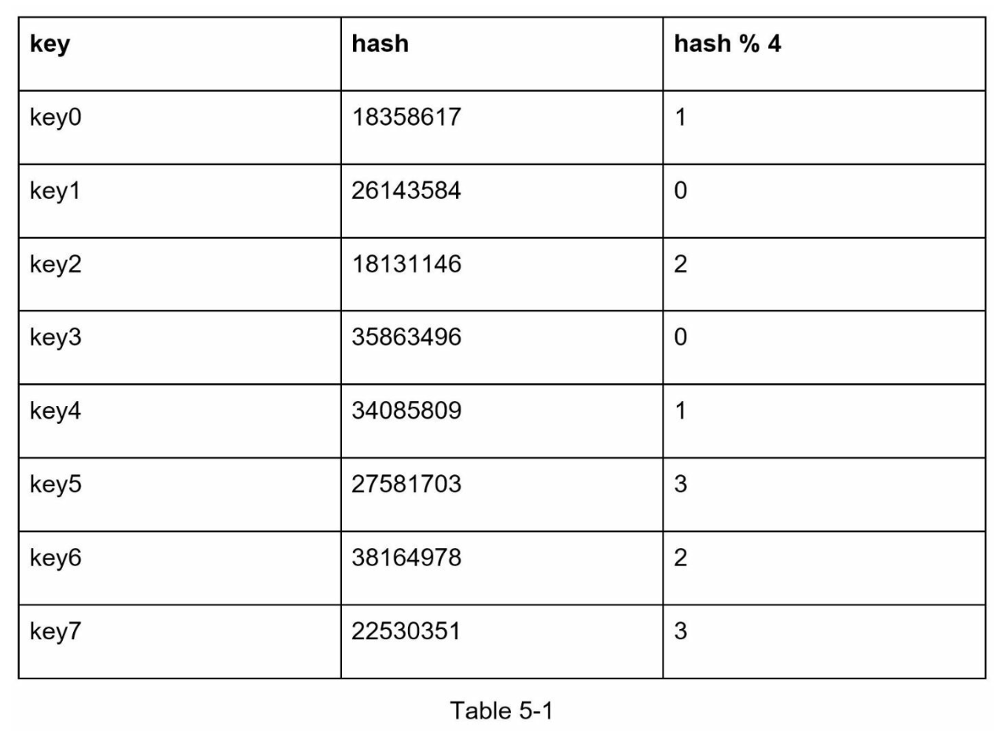

To fetch the server where a key is stored, we perform modular operation 
f(key)%4. For instance hash(key0)%4 =1 means a client must contact server 1 to fetch the cached data.

The above approach works well when the size of the server pool is fixed and the data distribution is even. However, the problems arise when new servers are added, or existing servers are removed. 

For example, if server 1 goes offline, most cache clients will connect to the wrong servers to fetch data. This causes a storm of cache misses. Consistent hashing is an effective way to mitigate this problem.

**Consistent Hashing:**
Consistent Hashing is a special kind of hashing such that when a hash table is re-sized and consistent hashing is used, only k/n keys need to be remapped on average, where k is number of keys, and n is number of slots. In contrast, in most traditional hash tables, a change in the number of array slots causes nearly all keys to be remapped.

**Hash space and Hash ring:**
Now we understand the definition of consistent hashing, let us find out how it works. Assume SHA-1 is used as hash function f, and the output range of the hash function is: x0, x1, x2, x2,x3....xn.  in cryptography, SHA-1's hash space goes from 0 to 2^160-1. That means x0 corresponds to 0, xn corresponds to 2^160-1, and all the other hash values in the middle fall between 0 and 2^160-1.

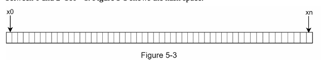

On connecting both ends, we get a hash ring as shown below.

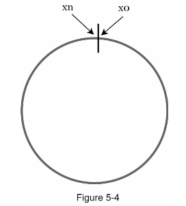

**Hash Servers:**

Using the same hash function f, we map servers based on server IP or name onto the ring.

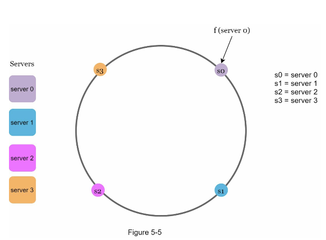

**Hash Keys:**

Hash functions used here is different from the one in "the rehashing problem," and there is no modular operations.

4 cache keys (key0, key1, key2, key3) are hashed into the hash ring.

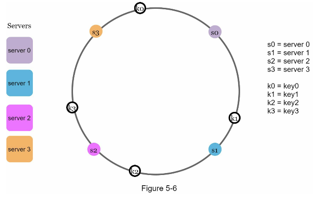

**Server lookup:**

To determine which server a key is stored on, we go clockwise from the key position on the ring until a server found. Going clockwise, key0 is stored on server 0; key 1 is stored on server 1; key 2 is stored on server 2; key 3 is stored on server 3.

**Add a server:**

Using the logic above, adding a new server will only require redistribution of fraction of keys.

After a server4 is added, only key0 is needed to redistribute to server4 as it was initially allocated to server0, but now server4 is added right after the key0 position, hence key0 is now re-distributed to server4. The other keys key2,key3,key4 are not redistributed based on consistent hashing algorithm.

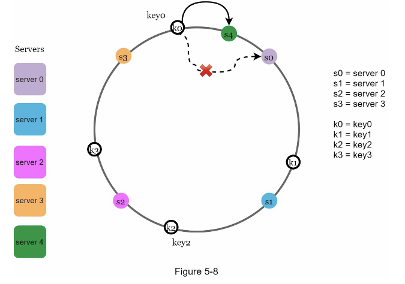

**Remove a server:**
When a server is removed, only a small fraction of keys are redistributed with consistent hashing. 
In Figure 5-9, wen server1 is removed, only key1 must be remapped to server2. The rest of the keys are unaffected.

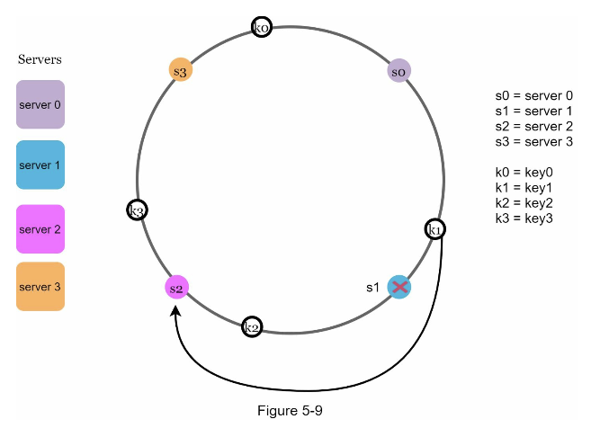

**Two issues in basic approach:**
The consistent algorithm was introduced by Karger et ak. at MIT. The basis steps are:

*  Map servers and keys on to the ring using a uniformly distributed Hash function.
*  To find out which server is mapped to which key, go in the clockwise directon of a key position to the first server on the ring is found.
  
Two problems are identified with this approach:

problem 1: First, It is impossible to keep the same size of partitions on the ring for all servers considering a server can be added or removed. A partition is the hash space between adjacent servers. It is possible that the size of the partitions on the ring assigned to each server is very small or fairly large. 

For Eg: If S1 is removed, S2's partition is twice as large as S0 and S3's partition.

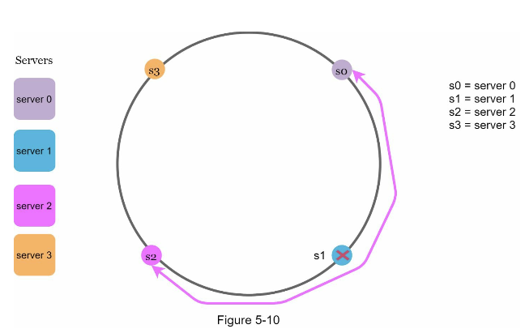

problem 2: Second, It is possible to have a non-uniform key distribution on the ring. For instance, if servers are mapped to positions listed, most of the keys are stored on server 2, where as server s3 and s1 has no keys.

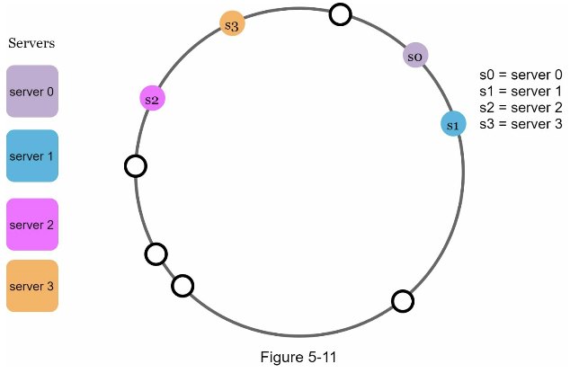

**Solution:**
A technique called virtual nodes or replicas are used to solve these problems.

**Virtual Nodes:**

Virtual Node refers to real node, and each server is represented by multiple virtual nodes on the ring.

In the Figure, both server 0 and server 1 have 3 virtual nodes. The 3 is arbitrarily chosen, and in real-world systems, the number of virtual nodes is much larger. Instead of using S0, we have s0_0, s0_1, s0_2 to represent server 0 on the ring. Similarly, s1_0, s1_1 and s1_2 represent server 1 on the ring.  With virtual nodes, each server is responsible for multiple partitions. Partitions (edges) with label s0 are managed by server 0. on the other hand, partitions with label s1 are managed by server 1.

 

To find which server a key is stored on, we go clockwise from the key's location and find the first virtual node encuntered on the ring. In the figure, we go from key k0 on the ring, we found virtual node s1_1 and this refers to server 

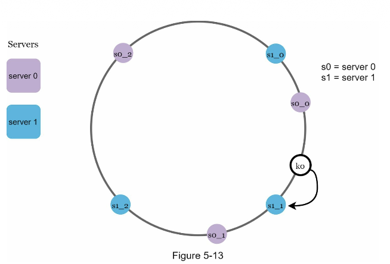

* As the number of virtual nodes increases, the distribution of keys become more balanced. This is because the standard deviation gets smaller with more virtual nodes, leading to balanced data distribution.
* Standard deviation terms how the data is spread out. The outcome of an experiment carried out by onlien research shows that with one or two virtual nodes, standard deviation comes as 5% (200 virtual nodes) and 10%(100 virtual nodes) of the mean.
* The standard deviation becomes smaller when we increase the number of virtual nodes. However, more spaces are needed to store data about virtual nodes.  
* This is a trade off, and we can tune the number of virtual nodes to fit our system requirements.

**Find affected keys:**
When a server is added or removed, a fraction of data needs to be redistributed. But, How can we find affected range where we redistribute the keys?

In the below figure, server 4 is added to the ring. So, the range affected starts from this position and we go in anticlockwise direction, where we found the key k0 is not allocated to s3, then keys between s3 and s4 are redistributed to s4.
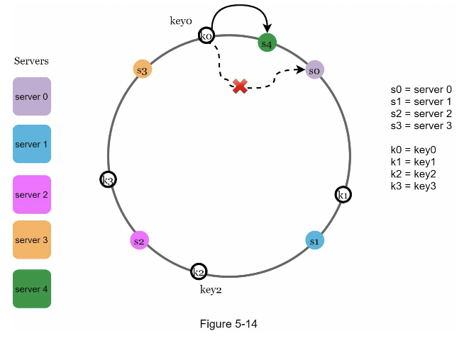

when server s1 is removed, then the affected range starts from s1, when we go anticockwise until server s0 we find the keys affected, we get key k1  and this is redistributed to s2.

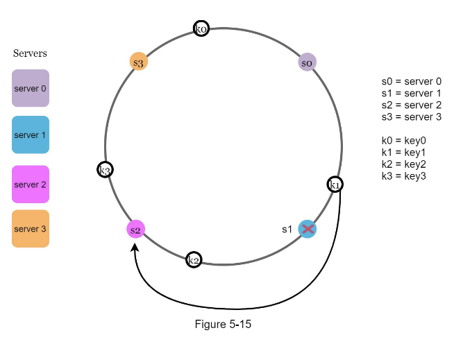

