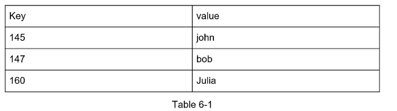

##### DESIGN A KEY-VALUE STORE:

**Key-value store:**  is also referred to as key-value database, is a non-relational database. Each unique identifier is stored as a key with its associated value. This data pairing is known as a "key-value" pair.

Keys can be plain text or hashed values. For performance reasons, a short key works better. What do keys look like?

* Plain text key: "last_logged_in_at"
* Hashed Key: 253DDEC4
  
The value in a key-value pair can be strings,lists,objects etc., The value is usually treated as an opaque object in key-value stores, such as Amazon dynamo, Memcached, Redis etc.,

data-snippet in a key value store:

Design a key-value store that supports the following  operations:

1. put(key,value)
2. get(key)