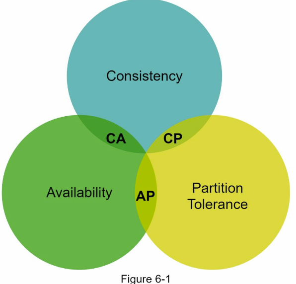
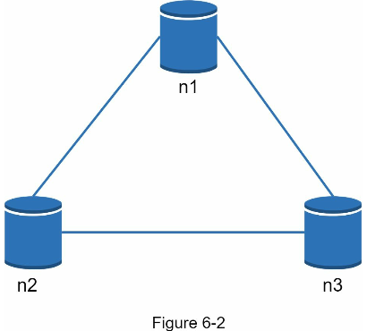
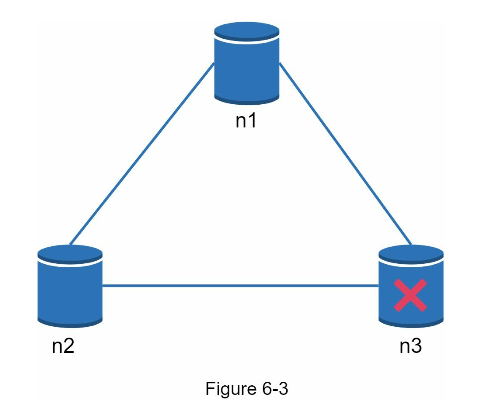

#### Understand the problem and establish design scope

There is no perfect design. Each design establishes the tradeoffs of the read, write and memory usage.

Another tradeoff has to be made was between consistency and availability. 

Here, we focus on designing the key-value store that comprises of following characteristics:

* The size of key-value pair is small : less than 10 KB.
* Ability to store big data.
* High Availability : The system responds quickly, even during failures.
* High Scalability: The system can be scaled to support large dataset.
* Automatic scaling: The addition/deletion of servers should be automatic based on traffic.
* Tunable consistency.
* Low latency.
  
**Single server key-value store**

Developing a key-value store that resides in a single server is easy. An intiutive approach is to store key-value pairs in a hash table, which keeps everthing in a memory. Even though memory access is fast, fitting everything in memory may be impossible due to the space constraint. 

Two optimizations can be done to fit more data on a single server:

* Data compression
* Store only frequently used data in memory and the rest on disk.

Even with these optimizations, a single server can reach its capacity very quickly. A distributed key-store is required to support big data.

**Distributed key-value store**

A distributed key-value store is also called a distributed hash table, which distributes key-value pairs across many servers.

when designing a distributed system, it is important to understand CAP (Consistency, Availability, Parition Tolerance) theorem.

**CAP Theorem**

CAP theorem states it is impossible for a distributed system to simultaneously provide more than two of these three guarantees

**1.Consistency:** consistency means all the cilents must see the same data at same time no matter which node they connect to.
**2.Availability:** availability means any client which requests data gets a response even if some of the nodes are down.
**3.Partition Tolerance:** a partition indicate a communication break between two nodes.
Partition tolerance means the system continues to operate despite network partitions.

**CP(Consistency and Partition tolerance) systems:** CP key-value store supports consistency and partition tolerance while sacrificing availability.

**AP(Availability and Partition tolerance) systems:** AP key-value store supports availability and partition tolerance while sacrificing consistency.

**CA(Consistency and Availability) systems:** CA key-value store supports consistency and availability while sacrificing partition tolerance. Since network failure is unavoidable, a distributed system must tolerate network partition. Thus, a CA system cannot exist in real-world applications.

In distributed systems, data is usuakky replicated multiple times. Assume data are replicated on three replica nodes n1,n2 and n3.

**Ideal situation:**

In Ideal situation, network partition never occurs, Data written to n1 is automatically replicated to nodes n2 and n3.
Both consistency and availability are achieved.

**Real world distributed systems:**

In a distributed systems, partitions cannot be avoided and when a partition occurs, we must choose between consistency and availability. In the figure, n3 goes down and cannot communicate with n1 and n2. If the clients write data to n1 or n2, data cannot be propagated to n3. If data is written to n3 but not propagated to n1 and n2 yet, n1 and n2 would have stale data.

If we chose consistency over availability **(CP system)**, then all the write operations to n1 and n2 are blocked to avoid data incosistency amond these three servers, which makes the system unavailable.
Bank systems usually have extremely high consistent requirements. For example, it is crucial for a bank system to display the most up-to-date balance info. If inconsistency occurs due to network partition, the bank system returns error before the incosistency is resolved.

However, If we chose availability over consistency **(AP system)**, the system keeps accepting the reads,but we might still read stale data as the consistency is compromised. For writes, n1 and n2 will keep accepting the writes, and the data will be synced to n3 when the network partition is resolved.

Chossing the right CAP guarantees that fir your usecase is an important step while building a distributed key-value store. You can discuss this with your interviewer and design the system accordingly.

