**System components:**

Core components and techniques used to build a Distributed Key-Value Store:

**1. Data partition:** 

For large applications, It is infeasible to fit the complete data set in a single server. The simplest way to accomplish this is to split data into smaller portions and store them in multiple servers. There are two challenges while partitioning data:

* Distribute data across multiple servers evenly.
* Minimize data movement when nodes are added or removed.

**Consistent Hashing at a high level :**

* First servers are placed on a hash ring,  eight servers, represented by s0, s1,....s7 are placed in the hash ring.
* Next, a key is hashed onto the same ring, and is allocated first server encountered in clockwise direction.

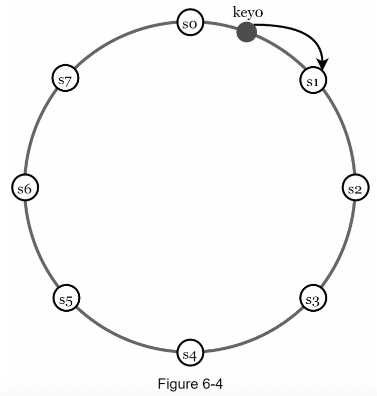

* For instance, key0 is stored in s1 using this logic.
  
Data partition has following advantages when consistent hashing is used:

* **Automatic scaling:** servers could be added and removed automatically depending on the load.
* **Heterogeneity:** The number of virtual nodes for a server depends upon the capacity of the server. For example, servers with high capacity are assigned with more virtual nodes.

**2. Data replication:**
To achieve high availability and reliability, data must be replicated asynchronously over N servers, where N is a configurable parameter.  These N servers are chosen using following logic: after a key is mapped to a position on the hash ring, walk clockwise from that position and choose first N srevers on the ring to store the data copies.

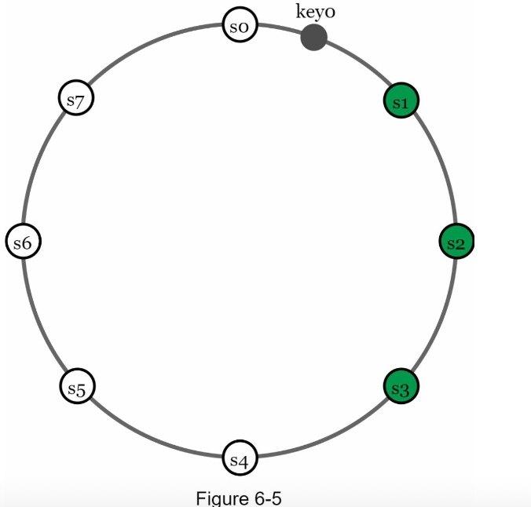

In the above figure, key0 is replicated at s1,s2 and s3.

With virtual nodes, the first N nodes on the ring may be owned by fewer than N physical servers. To avoid this issue, we only choose unique servers while performing the clockwise walk logic.

Nodes in the same data center often fail at the same time due to power outrages, network issues, natural disasters etc., For better reliability, replicas are placed in distinct data centers and data centers are connected through high speed networks.

**3. Consistency:**
Since data is replicated at multiple nodes, it must be synchronized across replicas. Quorum consensus can guanrantee consistency for both read and write operations, 

**N** = The number of replicas
**W** = A write quorum size of W. The write operation from W replicas sends the acknowledgment once the write operation is successful.
**R** = A read quorum of size R. For read operation to be considered as successful, read operation must wait for responses from at least R replicas.

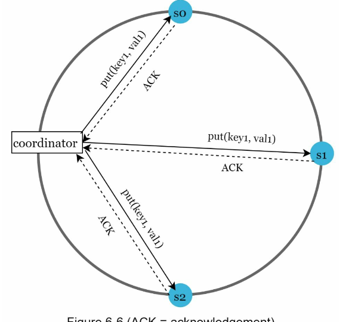

**W=1** does not mean data is written on one server. For instance, with the configuration, data is replicated at s0, s1 and s2. 
W=1 means that the coordinator must receive atleast one acknowledgement before the write operation is considered as successful.
For instance, if we get an acknowledement from s1, we no longer need to wait for acknowledgements from s0 and s2. 
A coordinator acts as a proxy between the client and the nodes.

The configuration of W, R and N is a typical tradeoff between latency and consistency. 
If W=1 or R=1, an operation is returned quickly because a coordinator only needs to wait for a response from any of the replicas. 
if W or R > 1, the system offers better consistency; however, the query will be slower because the coordinator must wait 
for the response from the slowest replica.

if W + R > N, strong consistency is guaranteed because there must be atleast one overlapping node that has the
latest data to ensure consistency.

if W + R <= N, strong consistency is not guaranteed.

Depending on the requirement, we can tune the values of W, R, N to achieve the desired level of consistency.

**Consistency models:**

Consistency model defines the degree of data consistency, and a wide spectrum of possible consistency models exist:

* **Strong consistency:**   any read operation always get the corresponding of the result of the most updated write data item. 
  Client never sees out-of-date data.

* **Weak consistency:** subsequent read operations may not see the most updated value.
  
* **Eventual consistency:** this is a specific form of weak consistency. Given enough time, all updates are propagated, 
  and all replicas are consistent.

Strong consistency is usually achieved by forcing a replica not to accept new reads/writes until every replica has agreed on current write.
But, this approach is not ideal for highly available systems because it block new operations.

Dynamo and Cassandra adopt eventual consistency, which is our recommended consistency model for our key-value store. 

From concurrent writes, eventual consistency allows inconsistent values to enter the system and 
force the client to read the values to reconcile.

The next section explains how the reconciliation works with versioning.

**4. Inconsistency resolution:versioning**
Replication gives high availability but causes inconsistencies among replicas.  
Versioning and vector looks are used to solve inconsistency problems.
Versioning means treating each data modification as a new immutable version of data. 

Before we talk about versioning, let us use example to explain how inconsistency happens:

both replica nodes n1 and n2 have the same value. Let us call this value the original value.
Server 1 and Server 2 get the same value for get("name") operation.

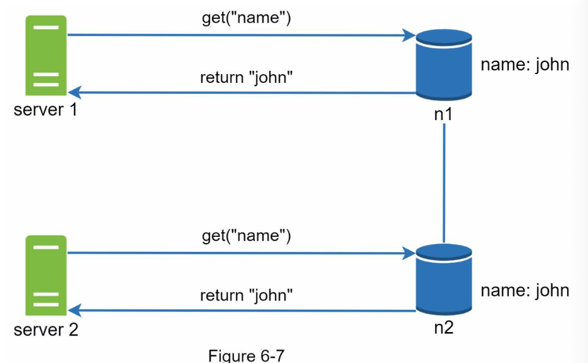

Next, server1 changes the name to "johnSanFrancisco" and server2 changes the name to "JohnNewYork".  As the two changes are performed simultaneously, we have conflicting values, called versions v1 and v2.

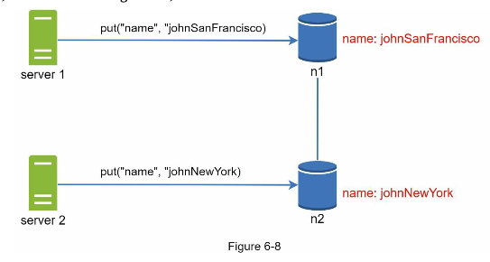

In this example, the original value could be ignored because the modifications are based on it.
However, there is no clear way to resolve the conflict of the last two versions. To resolve this issue, we need a versioning system that can detect the conflicts and reconcile conflicts. A vector clock is a common technique to solve this problem.

**Vector clock**  is a [server, version] pair associated with a data item. It can be used to check if one version preceds, succeeds or conflict with another.

Assume a vector clock, represented by D([S1,V1],[S2,V2],[S3,V3].....[Sn,Vn]) where D is a data item, V1 is version counter, S1 is server number etc., 

If D is the data item written to the server Si, the system must perform one of the following tasks.

* Increment the version vi if [Si,Vi] exists.
* Otherwise, create a new entry [Si,1].

When another client reads D3 and D4, it discovers a conflict, which is caused by data item D2 being modified by both Sy and Sz. The conflict is resolved by the client and updated the data sent to the server. Assume the write is handled by Sx, which now has D5([Sx,3],[Sy,1],[Sz,1]). We will explain how to detect conflict shortly.

Using vector clocks, it is east to tell that a version X is an ancestor (i.e., no conflict) of version Y if the version counters for each participant in the vector clock of Y is greater than or equal to the ones in version X. 
For example,  the vector clock D([s0,1],[s1,1]) is an ancestor of D([s0,1],[s1,2]). Therefore, no conflict is recorded.

Similarly, you can tell that a version X is a sibling(i.e., a conflict exists) of Y if there is any particpant in Y's vector clock who has a counter that is less than its corresponding counter in X. 
For example, the following two vector clocks indicate there is a conflict: D([s0,1],[s1,2]) and D([s0,2],[s1,1]).

Even though vector clocks can resolve confilcts, there are two notable downsides.

First, vector clocks add complexity to the client because it needs to implement conflict resolution logic.

Second,the pairs in the vector clock could grow rapidly. To fix this problem, we set a threshold for the length, and if it exceeds the limit, the oldest pairs are removed. This can lead to inefficiency in reconcilations because the descendent relationship cannot be determined accurately. However, based on Dynamo paper, Amazon has not yet encountered this problem in production; therefore, it is probably an acceptable solution for most companies.

**5. Handling failures:**

As with any large system at scale, failures are not only inevitable but common. 
Handling failure scenarios is very important. 

 **techniques to detect failures:**

 **Failure detection** 
 In a distributed system, it is insufficient to believe that a server is down just because another server says so. We need atleast two independent resources to mark a server down.

 In the below figure, all-to-all multicasting is a straightforward solution. However, this is inefficient when many servers are in the system.

 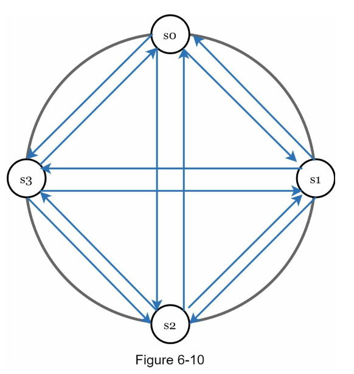

 A better solution is to use decentralized failure detection methods like gossip protocol. 

 Gossip protocol works as follows:

 * Each node maintains a node membership list, which contains member IDs and heartbeat counters.
 * Each node periodically sends heartbeats to a set of random nodes, which in turn propagates to another set of nodes.
 * Once nodes receives heartbeats, membership list is updated to the latest info.
 * If the heartbeat has not increased for more than predefined periods, the member is considered as offline.
  
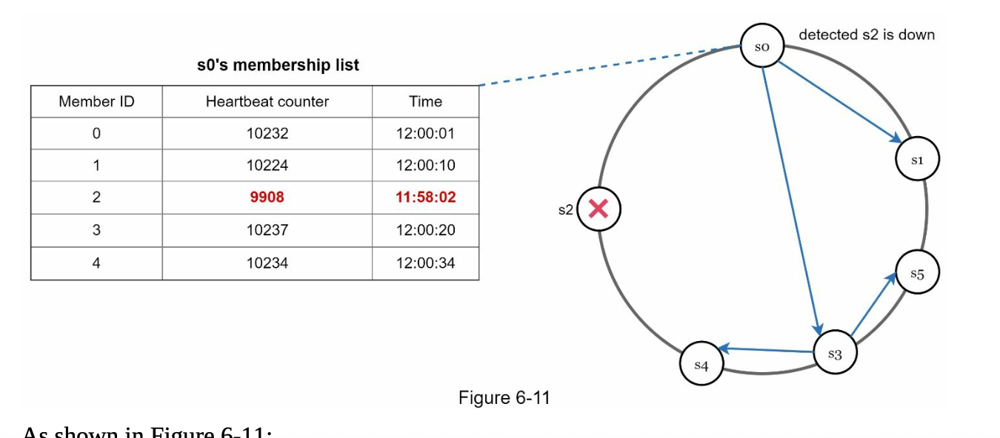

  
In the above figure, the Node 'so' identifies that node 's2' (memberId=2) heartbeat counter has not been updated for a longer time, Node 'so' sends heart beats that include s2's info to a set of random nodes. Once the other nodes confirm that s2's heartbeat counter has not been updated for a longer time, node s2 is marked down and this information is propagated to other nodes.

**handling temperory failures:**

After failures have been detected through the gossip protocol, the system needs to deploy certain mechanisms to ensure availability. In the **strict quorum **approach, read and write operations could be blocked.

**sloppy quorum:** is used to improve availability. Instead of enforcing the quorum requirement, the systesm chooses first W healthy servers for writes to be blocked and first R healthy servers to read are blocked on the hash ring. Offline servers are ignored.

**hinted handoff:**  If a server is unavailable due to network or server failures, another server will process requests temporarily. When the down server is up, the changes are pushed back to achieve data consistency. 

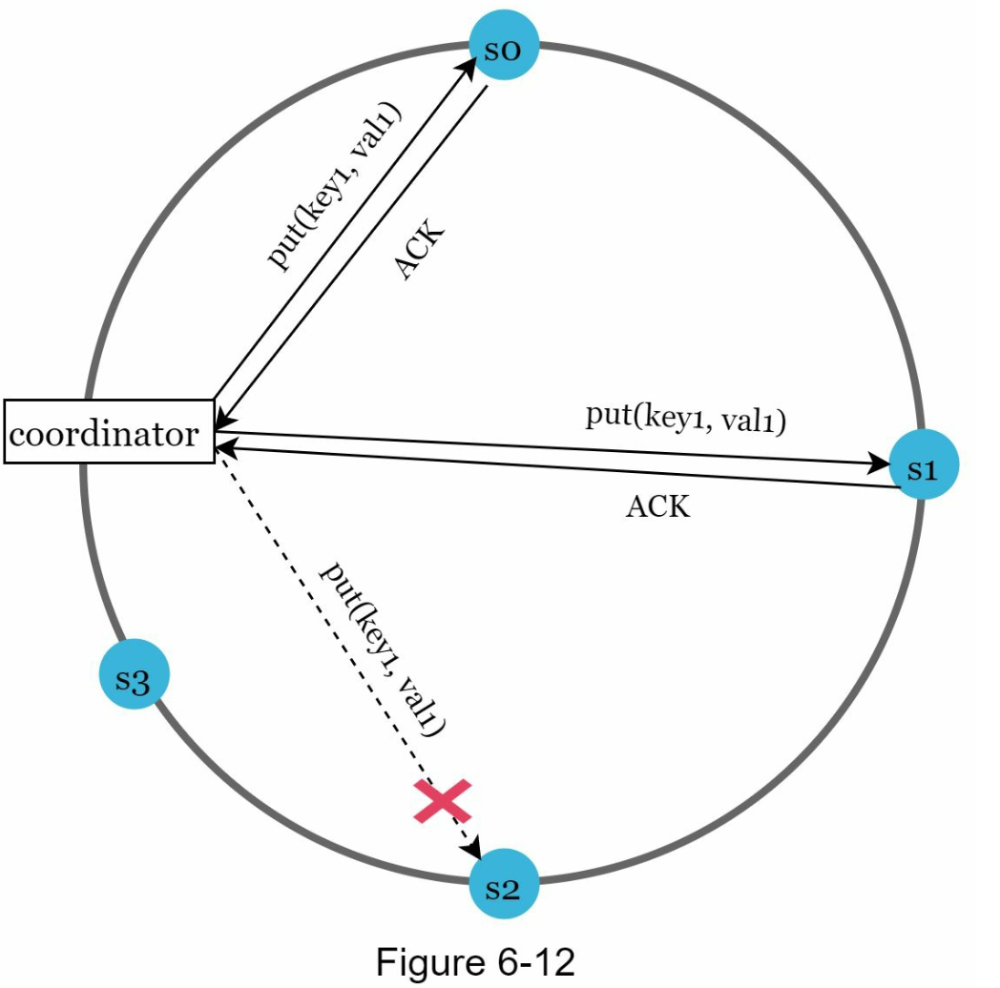

In the above figure, as the server s2 is offline, the server s3 handles the operations and pushes back the data to s2 when it recovers.

**handling permanent failures**

**Anti-entropy protocol:** compares each piece of data on replicas and updating each replica to the newest version.  
**Merkle tree** is used for incosistency detection and minimizing the amount of data transferred.

**What is Merkle tree?** 
non-leaf node is labeled with the hash of the labels or values (in case of leaves) of its child nodes. 
Hash trees allow efficient and secure verification of the contents of large data structures.

Assuming key space is from 1 to 12, the following steps how to build a merkle tree. 
Highlighted boxes indicate inconsistency.

**Step 1:** 
Divide key space into buckets ( 4 in our example). 
A bucket is used as the root level node to maintain a limited depth of the tree.

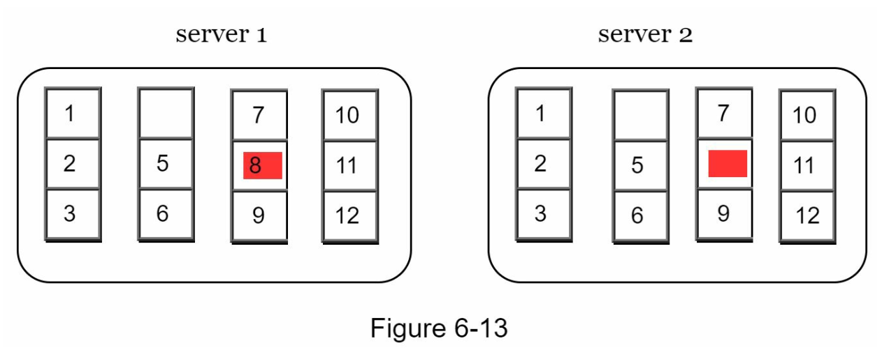

**Step 2:** 
Once the buckets are created, hash each key in a bucket using a uniform hashing method.

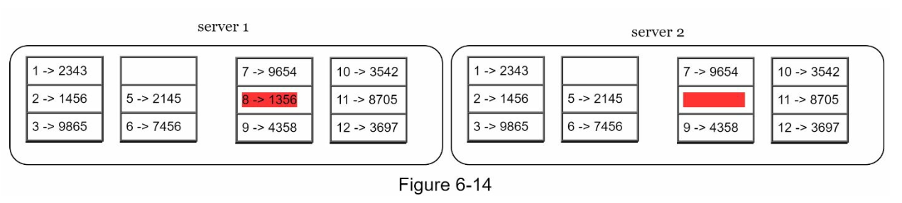

**Step 3:**
Create a single hash node per bucket.
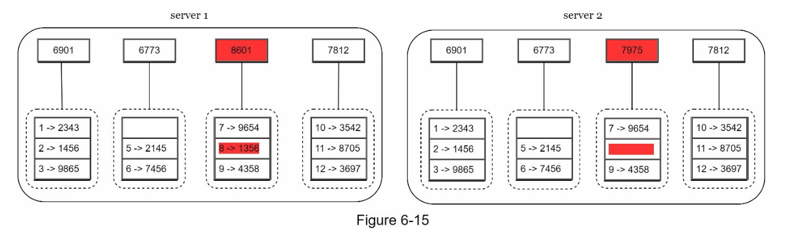

**Step 4:**
Build the tree upwards till root by calculating hashes of children.
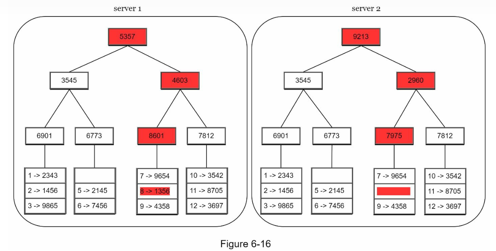.

To compare two Merkle trees, start by comparing the root hashes. 
If root hashes match, both servers have the same data. If root hashes disagree, then the left child hashes are compared followed by right child hashes. You can traverse the tree to find which buckets are not synchronzed and synchronize those buckets only. 

Using Merkle trees, the amount of data needed to be synchronized is proportional to the differences between the two replicas and not the amount of data they contain. In real-world systems, the bucket size is quite big. For instance, a possible configuration per one billion keys, so each bucket only contains 1000 keys.

**Handling data center outrage**

Data center outrage could happen due to power outrage, network ourage, natural disaster, etc.,
TO build a system capable of handling data center outrage, it is important to replicate data across multiple data centers.
Even if a data center is completely offline, users can still access data through the other data centers.

**System architecture:**

* Clients communicate with the key-value store through simple APIs: get(key) and put(key,value).
* A coordinator is a node that acts as proxy between the client and key-value store.
* Nodes are distributed on a ring using consistent hashing.
* The system is completely decentralized so adding and moving nodes can be automatic.
* Data is replicated at multiple nodes.
* There is no single point of failure as every node has the same set of responsibilities.
  
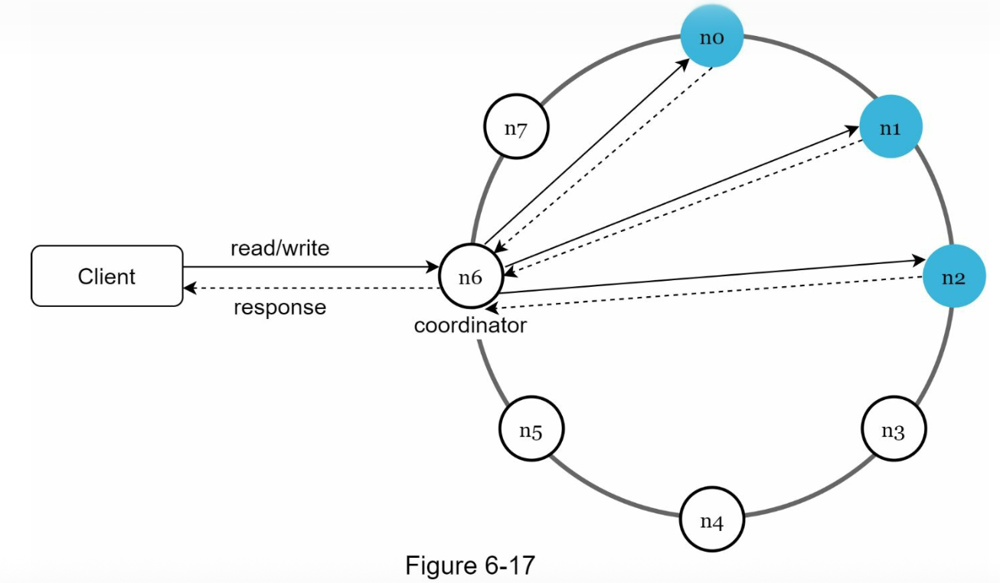

The decentralized version is depicted in the below figure.

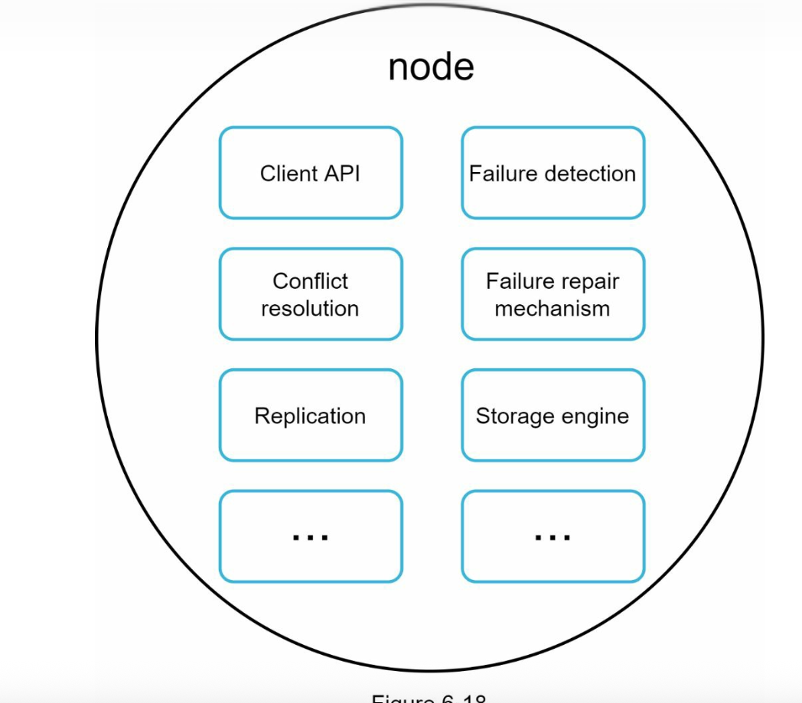

**Write path**

proposed designs for write/read paths are primary based on the architecture of Cassandra.

In the below figure, 
1. The write request is persisted on a commit log file.
2. Data is saved in the memory cache.
3. When the memory cache is full or reached a predefined threshold, data is flushed to SSTable on disk.
   Note : A sorted-string table is a sorted list of <key,value> pairs.

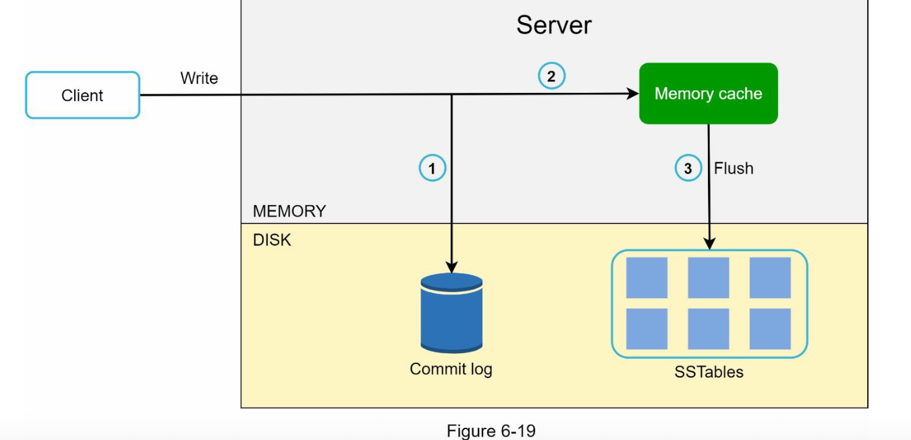

**Read path**

After read request is directed to a specific node, it first checks if the data is in the memory cache. If so, the data is returned to the client as shown in figure.

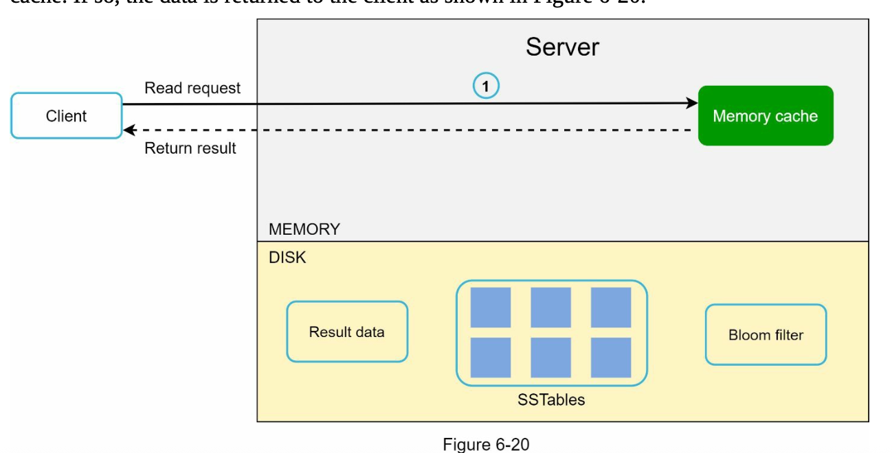

If the data is not in memory, it will be retreived from the disk instead. We need an efficient way to find out which SSTable contains the key. Bloom filter is commonly used to solve this problem.

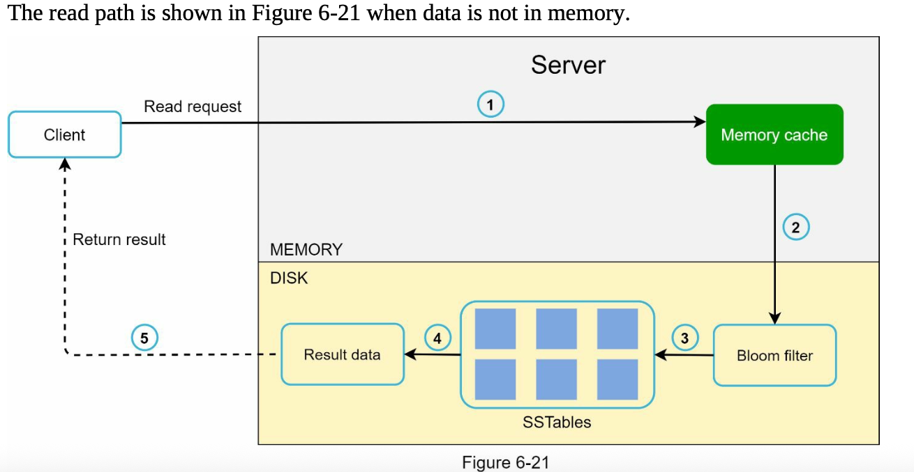

1. The system first checks if the data is in memory. If not, go to step 2.
2. If the data is not in memory, the system checks the bloom filter.
3. The bloom filter is used to figure out which SSTables might contain the key.
4. SSTables return the result of the data set.
5. The result of the data set is returned to the client.

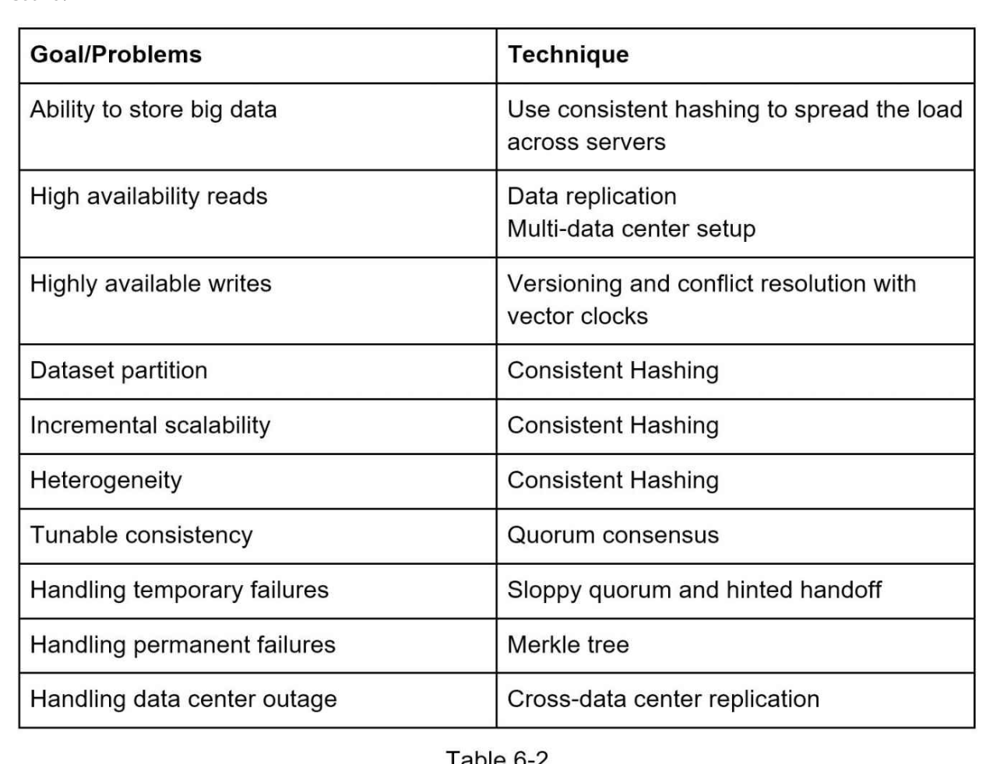

