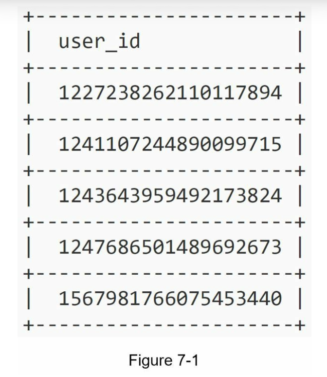

##### Design a unique ID generator in distributed systems

Use a primary key with the auto-increment attribute in a traditional database.

However, using a  primary key with an auto_increment does not work in a distributed system because a single database server is not large enough and generating unique IDs across multiple databases with minimal delay is challenging.

