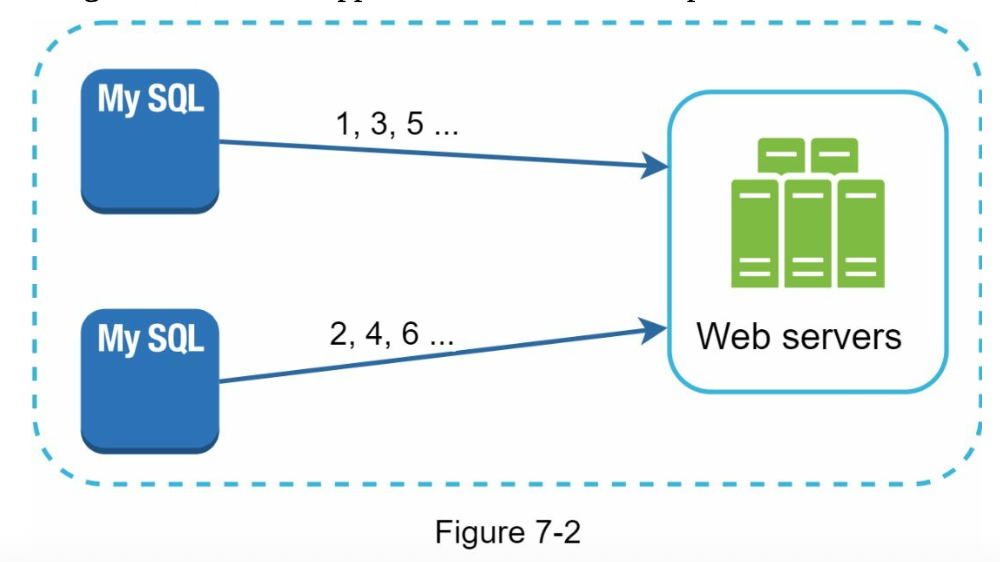
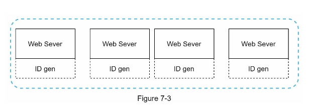
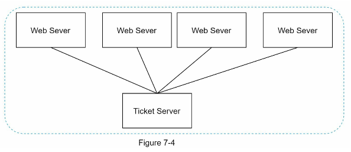
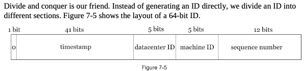

##### Step 2 - Propose high-level design and get buy-in

Multiple options can be used to generate unique IDs in distributed systems. The options we considered are:

* Multi-master replication
* Universally unique identifier (UUID)
* Ticket server
* Twitter snowflake approach

**Multi-master replication**

This approach uses the databases auto_increment feature. Instead of incrementing by 1, the ID is increased by k, where k is number of database servers in use. Say in th figure, next ID to be generated is equal to the previous ID in the same server plus 2. This solves some scalability issues because IDs can scale with the number of database servers.

However, this srategy has some major drawbacks:

* Hard to scale with multiple data centers.
* IDs do not go up with mutliple servers.
* It does not scale well when a sever is added or removed.
  
**UUID**

UUID is a 126-bit number used to identify information in computer systems. 
UUID has a very low probability of getting collusion.

wikipedia quote:
 "After generating 1 billion UUIDs, every second for approximately 100 years would the probability of creating a single duplicate reach 50%"

 

 In this design, each web server contains an ID generated, and a web server is responsible for generating IDs independently.

 **Pros:**

 * Generating UUID is simple. No coordination between servers is needed so there will not be any synchronization issues.
 * The system is easy to scale because each web server is responsible for generating IDs they consume. ID generator can easily scale with web servers.
  
**Cons:**

* IDs are 128 bits long, but our requirement is 64 bits.
* IDs do not go up with time.
* IDs could be non-numeric

**Ticket Server**
Flicker developed ticket servers to generate distributed primary keys. It is worth mentioning how the system works.

Idea is to use centralized auto_increment feature in a single database server.

**Pros:**

* Numeric IDs
* It is easy to implement, and it works for small to medium scale applications.

**Cons:**

* Single point of failure. Single ticket server means if the ticket server goes down, all systems that depend on it will face issues. 
  To avoid single point of faliure, we can have multiple ticket servers,but it will introduce new challenges such as data synchronization.

**Twitter snowflake approach:**

In order to satisfy our requirements, Twitter's unique ID generation system called "snowflake" is inspiring and can satisfy our requirements.

Divide and conquer approach. We divide an ID into different sections.

Each section is explained below:

* **Sign bit: (1 bit)** It will be always zero. This reserved for future uses. It can potentially be used to distinguish between signed and unsigned numbers.
* **Timestamp: (41 bits)** Milliseconds since the epoch or custom epoch. 
* **Datacenter ID: (5 bits)**  2^5 = 32 datacenters
* **Machine ID: (5 bits)**  2^5 = 32 machines per datacenter
* **Sequence number: (12 bits)** For every ID generated on that machine/process, the sequence number is incremented by 1. the number is reset to zero every millisecond.

