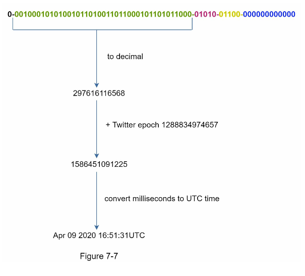

#### Step 3 - Design Deep Dive

From the various options while design a unique ID generator in distributed systems. 

we settle on Twitter snowflake approach design.

Diving deep into the design, Datacenters IDs and Machine IDs are chosen at startup time, 
generally fixed once the system is up running. Any changes in datacenter IDs and machine IDs require careful review. 
Since an accidental change in those values can lead to ID conflicts. Timestamp and sequence numbers are generated when the ID generator is running.

**Timestamp:**

The most important 41 bits make up the timestamp section.

The maximum timestamp that can be represented in 41 bits is

2^41 - 1 ~ 69 years 

ID generator will work for 69 years and having acustom epoch time to today's date delays the overflow time. 
After 69 years, we will need a new epoch time or adopt other techniques to migrate IDs

**Sequence number**

Sequence number is 12 bits, which give us 2^12 = 4096 combinations. 
This field is 0 unless more than one ID is generated in a millisecond on the same server. 
In thoery, a machine can support a maximum of 4096 new IDs per millisecond.

