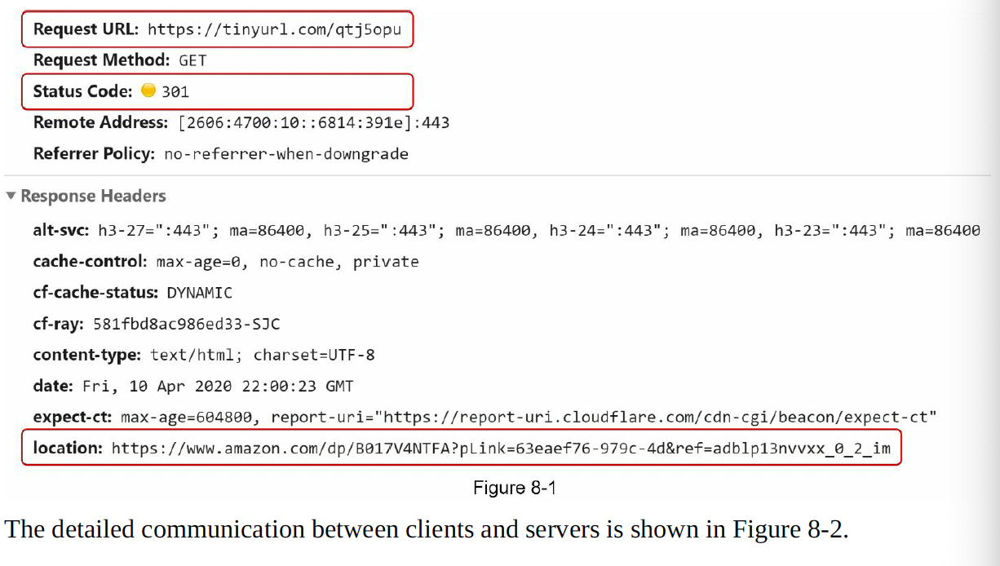
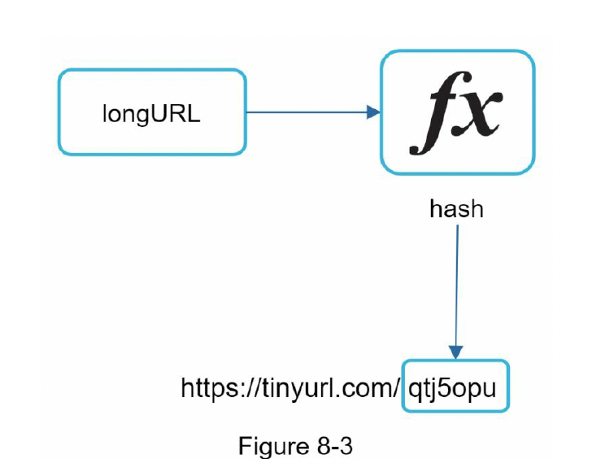

#### Propose high-level design and get buy-in

**API Endpoints**

API Endpoints facilitate the communication between client and servers. We will design the APIs REST-style. 

A URL shortner primary needs two API endpoints.

**1. URL Shortening:** To create a new short URL, a client sends a POST request, which contains one parameter: the original long URL. The API looks like this:
   
   POST api/v1/data/shorten

   * request parameter: {longUrl: longURLString}
   * return shortURL

**2. URL redirecting:** To redirect a short URL to the corresponding long URL, a client sends a GET request. The API looks like this:

   GET api/v1/shortUrl
    * Return longURL for HTTP redirection.
  

**URL redirecting**

when you enter tiny url in the web browser, once the server receives tinyurl request, it changes the short URL to the long URL with 301 redirect.

**301 redirect** 

shows that the requested URL is "permanently" moved to the long URL. 
Since it is permanently redirected, the browser caches the response, and subsequent requests for the same URL will not be sent to the URL shortening service.
Instead, the requests are redirected to the long URL server.

**302 redirect**

URL is "temporarily" moved to the long URL.
Subsequent requests for the same URL will be sent to the URL shortening service first.
Then, they are redirected towards long URL server.

Each redirection method has its pros and cons. 
If the priority is reduced the serverload, using 301 redirect makes sense as the 301 redirect makes sense as only the first request of the same URL is sent to URL shortening servers.
If the analytics is important , 302 redirect is the better choise as it is easy  to keep track of click rate and source of clicks.

The most intuitive way to implement URL redirecting is to use hash tables. 
Assuming the hash table stores <shortURL, longURL> pairs, thus URL redirecting can be implemented by:

* GET longURL : longURL = hashTable.get(shortURL)
* Once you get the longURL, perform the URL redirect.

**URL shortening**

www.tinyurl.com/**{hashValue}**

we must find a hash function fx that maps a long URL to the hashValue.

The hash function must satisfy the following requirements
* Each longURL must be hashed to one hashValue.
* Each hashValue can be mapped back to the longURL.

