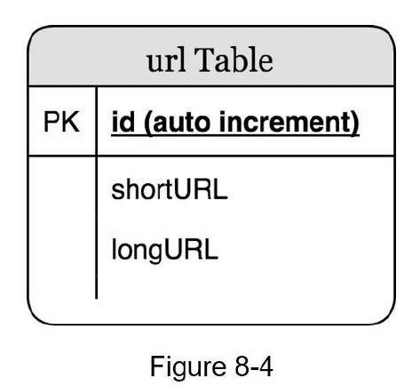
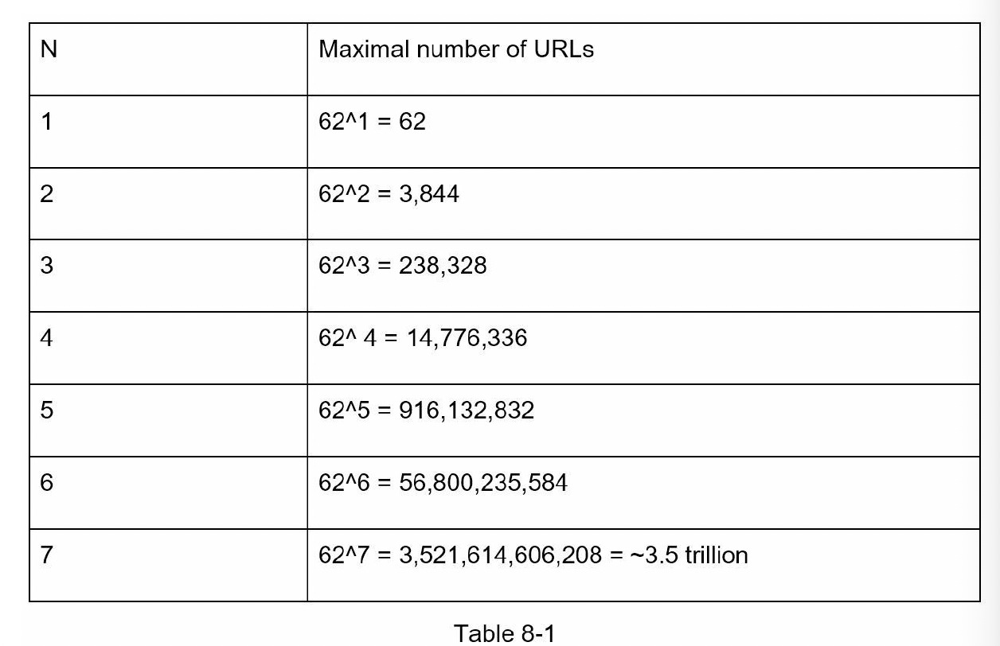
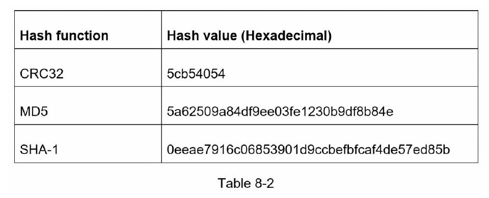
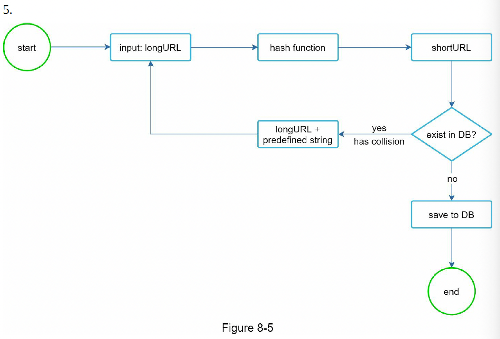
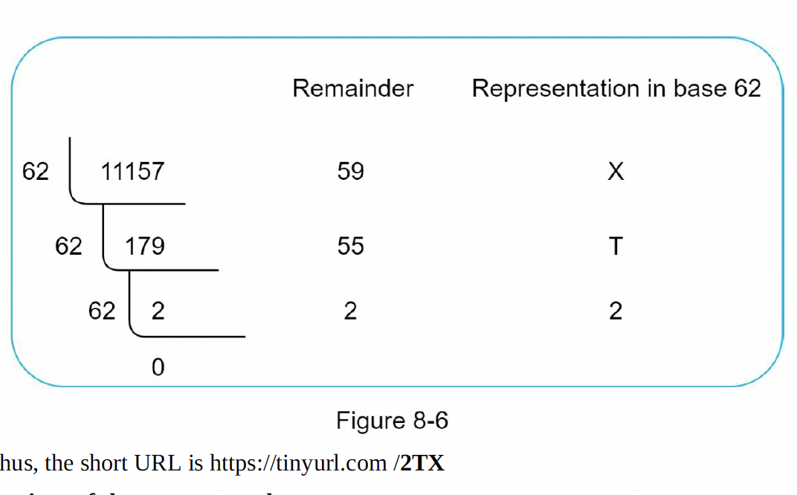
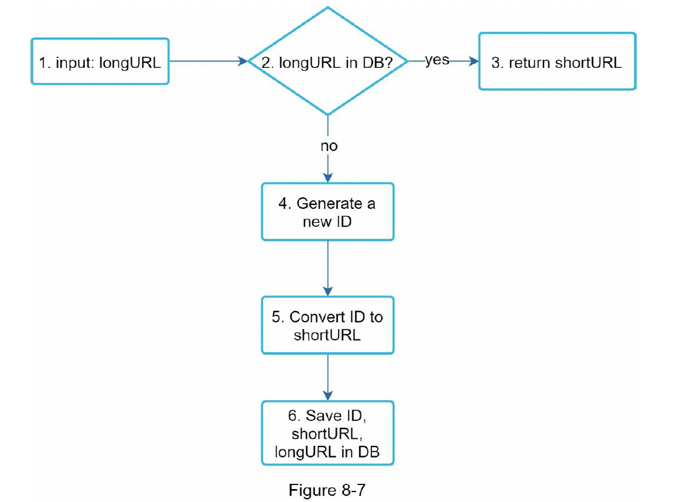
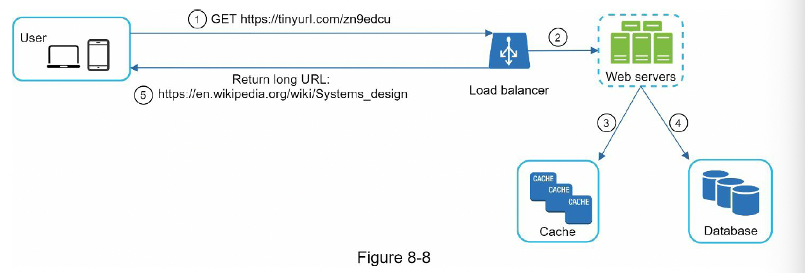

### Step 3 - Design Deep Dive

we deep dive into : data model, hash function, URL shortening, URL redirecting

**Data Model**

Everything data is stored in a hash table. This is a good starting point.
However, this approach is not feasible for real world systems as memory resources are limited and expensive.
A better option is to store <shortURL, longURL> mapping in a relational database.

**Hash function**

Hash function is used to hash a long URL to a short URL, also known as hashValue.

**Hash value length**

hashValue consisst of characters from [0-9,a-z,A-Z], contaning 10 + 26 + 26 = 62 possible characters. 
To figure out the length of hashValue, find the smallest n such that 62^n >= 365 billion.
The system must support up to 365 billion URLs based on the back of envelope estimation.

when n=7, 62^n = ~3.5 trillion which is more than enough to hold 365 billion urls, so the length of hashvalue is 7.

**Two types of Hash functions:**

**Hash + Collision resolution** 

we should implement a hash function that hashes a long URL to a 7-character string.

Even the shortest hash value (from CRC32) is too long (more than 7 characters). How can we make it shorter?

If we extract first 7 characters  of hash value, it leads to hash collision.
To resolve hash collisions, we can recursively append a new predefined string until no more collision is discovered.

This method can eliminate collision; however, it is expensive to query the database to check if a shortURL exists for every request.

A technique called Bloom filter can improve performance. A bloom filter is a space-efficient probabilistic technique to test if an element is a member of a set.

**Base 62 conversion**

Base conversion is another approach commonly used for URL shorteners.
Base conversion helps to convert same number between its different number representative systems.

Base 62 conversion is used as there are 62 possible characters for hashValue.

Let us use an example to explain how the conversion works: convert 11157 base 10 to base 62 representation.

( 11157 base 10 represents in a base 10 system ).

* From its name, base 62 is a way of using 62 characters for encoding. The mappings are: 0-0,...,9-9,10-a,11-b...,35-z, 36-A,....61-Z where 'a' stands for 10, 'Z' stands for 61 etc.,
* 11157 base 10 = 2 x 62^2^ + 55 x 62^1 + 59 x 62^0 = [2, 55, 59] -> [2, T, X] in base 62

**Comparision of the two approaches**

| **Hash+collision resolution**  | **Base62 conversion** |
| ------------------------------ | --------------------- |
| Fixed short URL length.        | The short URL length is not fixed, goes up with ID |
| No unique ID generator         | depends upon unique ID generator |
| Collision is possible and must be resolved | Collision is impossible due to unique ID generator |
| It is impossible to figure out the next available short URL as it does noy depend on ID | It is possible to determine next short URL as the ID is incremented by 1, that raises security concerns|

**URL shortening deep dive**

**URL redirecting deep dive**

